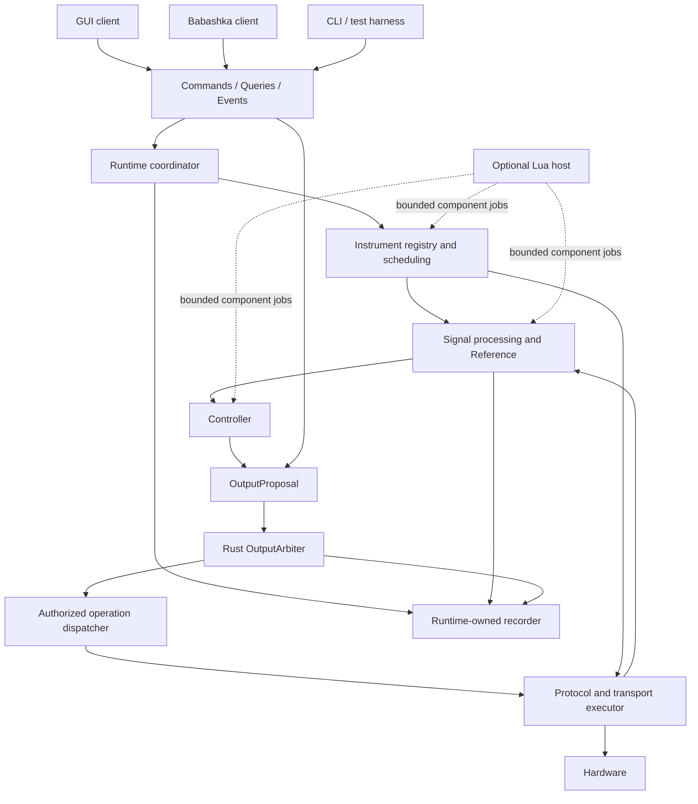
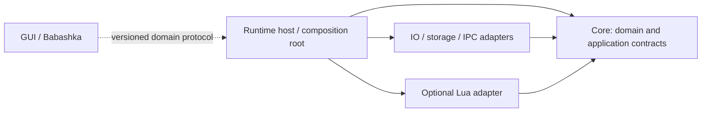
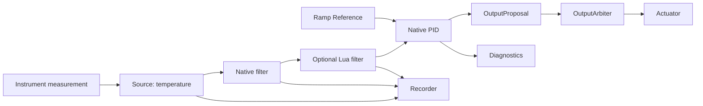

# Высокоуровневая архитектура lab-runtime

Статус: архитектурное предложение для review, без реализации. Дата: 2026-09-14.

Основание: полностью прочитанные [AGENTS.md](../../AGENTS.md), [PROJECT_BRIEF.md](../../PROJECT_BRIEF.md) и [ARCHITECTURE_PLAN.md](../../ARCHITECTURE_PLAN.md), включая добавленное содержимое первых двух файлов. Код `com_port_reader` не исследовался. Совместимость и перенос v1 относятся к отдельному этапу после утверждения архитектуры.

## 1. Цели и границы этапа

Предлагается один автономный Rust Runtime: он владеет экспериментом, выполняет сбор и обработку данных, планирует управление, разрешает физические воздействия и ведёт долговременную запись. GUI и внешние сценарии являются клиентами. Локальные расширения подключаются через ограниченные контракты компонентов. Это модульное приложение, а не распределённая система или универсальный plugin framework.

Приоритеты следуют AGENTS.md: safety, ясность модели, расширяемость, интерактивная разработка, надёжность многодневной работы, тестируемость, простота, затем производительность. Новый прибор известного протокола или экспериментальный фильтр должен добавляться без изменения Core. Новая низкоуровневая возможность или новое правило safety может потребовать Rust.

Начальная область: небольшие лабораторные установки, serial/COM/RS-485, один Runtime — владелец подключённых ресурсов, локальные клиенты. TCP, replay и удалённые клиенты должны добавляться через существующие границы. Количество приборов, частоты, допустимая задержка управления и аппаратные безопасные состояния пока не заданы; конкретные численные гарантии не предполагаются.

Non-goals этого этапа: production-код, Cargo workspace, Rust traits, Lua bindings, сервер IPC, GUI, Babashka-проект, перенос v1, полный wire protocol, выбор библиотек и формата хранилища. Также не предлагаются hard-real-time гарантии обычного процесса, автоматическое восстановление активных выходов после crash, native plugin ABI или распределённое владение оборудованием.

## 2. Domain model: сначала сущности

«Владелец» ниже означает единственный авторитетный источник изменяемого состояния. Рабочая задача может хранить закрытое вычислительное состояние, но её lifecycle и применение результатов контролирует Runtime. Идентификаторы устойчивы в пределах сессии, экземпляры имеют generation, определения — revision. Клиенты получают снимки и ссылки по ID, а не доступ к изменяемым объектам.

| Сущность | Зачем существует | Кто владеет состоянием | Кто о ней знает | Статус в модели |
| --- | --- | --- | --- | --- |
| Runtime | Самостоятельный host и координатор эксперимента | Процесс Runtime; coordinator владеет registry и lifecycle | Все адаптеры через domain boundary | Application boundary, не универсальный объект с каждой функцией |
| Experiment / Session | Связывает конфигурацию, запуск, участников и историю | Runtime; запись имеет отдельную RecordingSession | Controllers, recorder, клиенты | Domain; явно добавлена к исходному списку |
| Transport | Представляет канал и конфликтующий физический ресурс | Один Rust transport executor на порт/шину | Protocol adapters, scheduler; клиенты видят только статус/конфигурацию | Ресурс установки — domain; handle COM — implementation detail |
| Protocol | Правила обмена: операции, framing, проверка ответа | Rust protocol adapter, состояние соединения при необходимости | Instrument adapters и transport executor | Техническая граница; не обязательная отдельная сущность публичного API |
| Instrument | Логический экземпляр прибора с параметрами и операциями | Runtime instrument registry и управляемый им adapter | Signals, output dispatcher, coordinator, клиенты | Domain; не равен порту или driver class |
| InstrumentDescriptor | Описывает возможности неизвестного заранее прибора | Registry хранит неизменяемую версию определения | GUI, Babashka, validators, recorder | Domain data, не исполняемая логика |
| Parameter | Именованная типизированная величина или настройка прибора | Определение в descriptor; observed value в instrument state | Acquisition, commands, signals, output boundary | Domain data; не отдельный actor/trait |
| Signal | Типизированный поток наблюдений или вычисленных значений | Signal engine | Processing nodes, controllers, recorder, subscriptions | Domain; значение, качество и время неразделимы |
| Series | Идентифицированная последовательность samples сигнала | Runtime хранит ограниченное окно; recorder — durable history | Window filters и history queries | Domain view; не бесконечный mutable vector |
| SignalNode | Экземпляр вычисления с входами, выходами и lifecycle | Runtime registry; worker хранит закрытое состояние | Signal engine, diagnostics, extension host | Общая роль вычисления, минимальный контракт по необходимости |
| Source | Роль производителя сигнала | Adapter/Runtime, которому принадлежит источник | Signal engine | Роль SignalNode, без отдельной иерархии |
| Transform | Преобразование входных samples | Processing worker под управлением Runtime | Signal engine | Роль SignalNode |
| Filter | Преобразование с состоянием/окном | Processing worker; окно ограничено | Signal engine, diagnostics | Специализация Transform по поведению; отдельный trait не нужен заранее |
| Reference | Источник желаемого значения во времени | Runtime reference instance | Controllers, signal engine, clients | Domain; роль Source с явной семантикой времени |
| Controller | Вычисляет предложения воздействия из measurement/reference | Runtime controller registry; controller worker хранит алгоритм | Scheduler, signals, references, arbiter | Domain с отдельным lifecycle; не обычный signal sink |
| OutputProposal | Намерение владельца установить значение выхода | Неизменяемое сообщение; после проверки — arbiter | Controller/manual/external producer, arbiter, recorder | Domain data; не команда драйверу |
| OutputArbiter | Единственное место разрешения выходных воздействий | Rust safety service | Controllers, command handlers, trusted dispatcher, recorder | Domain policy/service |
| OutputChannel / Lease | Связывает actuator с владельцем и сроком полномочий | Только OutputArbiter | Controller registry, instrument dispatcher, clients через snapshots | Domain; добавлены, чтобы владение не было неявным |
| Recorder | Делает историю эксперимента долговременной | Runtime recording service | Domain event stream, measurements, history adapter | Domain responsibility; storage backend — adapter |
| Command | Запрашивает изменение с проверкой полномочий и предусловий | Coordinator/целевой domain owner | Все клиенты и разрешённые локальные adapters | Domain message |
| Query | Читает снимок или историю без side effects | Snapshot owner или history service | Клиенты и ограниченные extension contexts | Domain request |
| Event | Сообщает совершившийся переход, измерение или диагностику | Источник события под управлением Runtime; recorder сохраняет | Подписчики, recorder, диагностика | Domain fact, не произвольный вызов callback |
| Extension | Версионированное определение и управляемый экземпляр компонента | Runtime registry и соответствующий host | Instrument/processing/controller registries | Deployment/lifecycle concept; не самостоятельное приложение |
| Client | Сессия взаимодействия с Runtime | IPC adapter хранит соединение; Runtime — actor/session identity и leases | Domain gateway, subscriptions, arbiter | Application concept, не владелец эксперимента |

Sink — роль получателя, а не обязательная новая абстракция: recorder принимает данные, GUI получает subscription, физический выход принимает только разрешённые воздействия. Не объединяем их в общий способ `write`, который мог бы обойти safety. Experiment и RecordingSession разделены: техническая сессия может существовать без записи, но управление реальными выходами по умолчанию требует исправной записи.

## 3. Instrument model

Общий контракт прибора: опубликовать descriptor, пройти configuration/validation, connect/disconnect, выполнить объявленную операцию чтения или разрешённую операцию изменения, вернуть типизированный результат с качеством, временем и диагностикой. Runtime запускает polling; драйвер не создаёт собственный автономный цикл управления. Конкретные Rust interfaces пока не фиксируются.

Native, data-driven, Lua и virtual implementations регистрируются одинаково. Способ исполнения виден для диагностики и допуска в контур управления, но не нужен generic GUI для чтения температуры или отображения power. Virtual/replay явно маркируют происхождение samples; replay по умолчанию не допускается как вход физического управления.

Instrument lifecycle: registered → configured → connecting → online; ошибки ведут в degraded/offline. Reconnect создаёт новую generation обменов. Removal требует остановки зависимых задач и отзыва output leases. Изменение адреса или определения во время активного управления не является обычным live-edit.

Descriptor содержит:

- Schema/definition version, type ID, instance ID, identity/model/serial при наличии, display name, provenance и implementation kind. Адрес шины и credentials относятся к instance configuration; read-only introspection не обязан раскрывать все настройки доступа.
- Parameters: стабильный ID, label, value type (число, boolean, enum, string и необходимые явно поддержанные составные типы), units, readable/writable, значение по умолчанию только если оно имеет смысл, диапазоны, разрешение и режим изменения.
- Семантическая роль: measurement, configuration, control output или action. Запись setpoint внутреннего регулятора прибора тоже является воздействием. Команды enable, calibration, mode change и reset классифицируются по side effects.
- Capabilities: polling/read, write configuration, control output, readback/acknowledgement, health, simulation/replay, объявленные специфические операции. Для операции указаны параметры, ограничения, preconditions, side effects и модель подтверждения. Неизвестная capability не подразумевает разрешение на действие.
- Требования свежести/частоты и технические пределы — как сведения для валидации. Safety policy установки хранится отдельно; driver limits не являются окончательным разрешением.

Parameter definition и observed parameter state различаются. State включает последнее успешно наблюдённое значение, время наблюдения, quality и последнюю ошибку; desired output, transport acknowledgement и measured/readback output хранятся раздельно. Query текущего значения не инициирует скрытый I/O; явный refresh — Command с последующим результатом.

GUI/Babashka выполняют discover → describe → query/subscribe → domain command. Клиент строит поля по типам/units/capabilities и отображает причину недоступности операции. Валидация всегда повторяется Runtime. Device-specific presentation возможна как дополнение GUI, но не переносит instrument semantics из Runtime.

## 4. Component boundaries и зависимости

Rust Core — библиотека domain/application правил: lifecycle, registry, типы и валидация, ownership, scheduling policy, signal/reference/controller orchestration, native control/processing algorithms, OutputArbiter, recording policy, Commands/Queries/Events и контракты внешних исполнителей. Core не знает GUI framework, Lua VM, COM API, wire encoding или storage engine.

Rust Runtime — развёрнутое приложение, включающее Core и доверенные adapters. Поэтому физическое I/O остаётся собственностью Rust Runtime, хотя библиотека Core не открывает COM сама.

| Компонент | В Core | Вокруг Core |
| --- | --- | --- |
| Physical I/O | Resource identity, transaction deadlines и policy | Serial executor; позже TCP executor |
| Protocols / instrument drivers | Instrument contract и проверка результатов | Native protocol codecs, drivers, interpreter data definitions |
| Scheduler | Планирование, дедлайны, допустимость работы | Clock/executor integration, конкретные tasks/threads |
| Signals, filters, controllers, references | Модель, lifecycle, native algorithms | Lua/external implementations через host contracts |
| Output safety | Политика, ownership, interlocks, выдача разрешений | Доверенный Rust dispatcher исполняет разрешённые операции |
| Recorder | Состав истории, lifecycle, требования durability | Storage writer, чтение архивов, export |
| Lua runtime | Языконезависимые контракты и budgets | Опциональный embedded host с отдельным исполнением |
| IPC | Domain boundary, client identity/permissions | Session handling, encoding, локальный listener |
| GUI / Babashka | Никаких зависимостей | Отдельные процессы-клиенты |

Диаграмма исполнения; стрелки обозначают поток запросов/данных, а не Cargo dependencies:



Путь Instrument → I/O на диаграмме разрешает чтения и проверенные lifecycle/configuration operations; любые действия с влиянием на выход требуют safety-разрешения. Подробнее: [RUNTIME_AND_SAFETY_MODEL.md](RUNTIME_AND_SAFETY_MODEL.md).

Направление compile-time dependencies:



Core получает предоставленные host исполнители через узкие границы там, где действительно нужно заменить I/O, часы, storage или component runner. Не создаём traits для каждого domain data type и не проектируем общий service locator.

## 5. Transport / Protocol / Instrument

Разделение полезно как распределение ответственности; делать клиентский API трёхэтажным необязательно. Клиенту нужен «read temperature», а не ручная сборка стека. Несколько instruments могут разделять один protocol executor и один RS-485 bus; virtual instrument обходится без транспорта.

| Ответственность | Владелец |
| --- | --- |
| Port ownership, open/close, bus settings | Один Rust transport executor; несовместимые настройки общей шины отклоняются при configuration |
| Serialization of transactions | Runtime scheduler этого конфликтующего ресурса; одна незавершённая транзакция для начальной serial-модели |
| Queue deadline / transaction deadline | Runtime; истекает и ожидание в очереди, и сам обмен |
| Byte I/O и ограничение размера ответа | Transport executor |
| Framing, CRC, response correlation, protocol parsing | Protocol adapter; для простых нестандартных приборов — проверенный bounded transaction profile |
| Retry | Runtime policy с информацией adapter об идемпотентности операции; не вложенные бесконечные retries |
| Units, scaling, parameter semantics | Instrument definition/adapter; safety проверяет нормализованное значение |
| Output authority | OutputArbiter и повторная проверка разрешения перед передачей байтов |

Занятую транзакцию нельзя считать мгновенно прерываемой. Safety получает приоритет между обменами; максимальная длительность обмена входит в бюджет реакции. После timeout/позднего ответа adapter должен восстановить framing и корреляцию, прежде чем обслуживать следующие запросы. Не допускается слепое повторение неоднозначно выполненной write/action.

Lua не получает port handle или unrestricted raw transaction API. Для физического прибора она вызывает именованные операции из проверенного определения с фиксированной привязкой к ресурсу и адресату. Rust формирует ограниченный обмен; все side effects проходят OutputArbiter. Ограничения script-backed instruments и доверия к определениям описаны в [EXTENSION_MODEL.md](EXTENSION_MODEL.md).

## 6. Signals, history и Reference

Для small-scale обработки подходит типизированный направленный ациклический граф. Source, Transform и Filter — роли узлов. Controller — отдельный запланированный consumer сигналов; recorder и GUI — независимые subscribers. Обратная связь через физический процесс не превращается в немедленный программный цикл. Произвольные циклы, fixed-point evaluation и универсальный workflow engine в первой версии не нужны.



Lua filter здесь иллюстрирует заменяемость, а не обязательную зависимость production PID от Lua. Если controller использует script result, истечение его свежести останавливает соответствующее управление; независимые native цепочки продолжают работать.

Sample включает Signal ID, source/node generation, sequence, value, units/type, quality, monotonic timestamp приёма, wall-clock timestamp для истории и device timestamp при наличии с указанием его происхождения. Не подменяем потерянное измерение нулём. Derived sample сохраняет связь с входными sequences/временами; вычисление заново не делает старое измерение свежим.

Current value — cache последнего sample с возрастом, включая invalid/stale state. Series window — ограниченная история для алгоритма или оперативного графика. Recorded history — долговременные samples и события; только recorder отвечает за её полноту и durability. GUI cache и transient subscription не являются историей эксперимента.

Узлы объявляют входы/выходы, типы/units, способ запуска, максимальное окно, configuration и допустимую стоимость выполнения. Начальная модель: распространение новых samples по DAG, controller tick по monotonic clock; нет неограниченного callback каскада. Multi-input node задаёт допустимый возраст и рассогласование времён; по умолчанию использует последний пригодный sample каждого входа, а не выдумывает синхронность. Window filter ждёт достаточного окна и сообщает warming-up. Смешение единиц требует явного преобразования.

Добавление native или Lua filter меняет регистрацию реализации, а не модель графа. Конфигурация графа проверяется целиком: связи, типы, units, отсутствие циклов, бюджеты и safety dependencies. Замена активной ветви требует безопасной остановки затронутого контура; непричастные ветви продолжают работу.

Diagnostics публикуются отдельно от основного значения: качество, возраст, dropped samples, execution duration, deadline misses, saturation, algorithm state по объявленной схеме. Частота диагностики ограничивается, переходы отказа сохраняются как events.

Reference — хорошая базовая абстракция: желаемое значение является самостоятельным сигналом, применимым к PID, On/Off и будущим стратегиям. Fixed возвращает константу; Ramp меняет значение с заданной скоростью; Program задаёт конечную последовательность сегментов; Script реализует тот же контракт в ограниченном host. Program не является языком orchestration.

Время Reference — monotonic experiment time с явным start/pause/resume/reset. По умолчанию paused Reference замораживает progress; resume продолжает от этой точки, reset возвращает начальное состояние. У shared Reference собственный lifecycle: pause одного consumer не останавливает остальных. Если controller должен возобновлять именно свою ramp без скачка, ему нужен отдельный Reference. Выход за пределы и rate-of-change всё равно проверяет safety; Reference не выдаёт разрешения на hardware.

## 7. Controllers и клиенты

Controller получает согласованный snapshot измерений/reference, dt и информацию о принятом/ограниченном воздействии; возвращает OutputProposal и diagnostics. Алгоритм не пишет в прибор. PID и On/Off — native implementations. Furnace сохраняется как требование к native controller с внутренним состоянием или композицией; его фактическое поведение и перенос определяются только на следующем этапе анализа v1. Общая граница должна позволять более одного входа/предложения, но атомарная запись нескольких физических выходов не обещается.

Lifecycle включает creation, configuration, running, pause, resume, reset, removal и failure. Pause/removal отзывают владение выходом и запускают safe transition; resume требует повторной проверки и нового lease. Состояние алгоритма, состояние Reference и разрешение на выход различаются. Подробные переходы — в [RUNTIME_AND_SAFETY_MODEL.md](RUNTIME_AND_SAFETY_MODEL.md).

GUI получает descriptors, snapshots, samples, diagnostics, command outcomes, output state и recording health. Отправляет команды configuration/lifecycle/manual control и запросы истории. Обновления идут через subscriptions с cursor и явным gap/resync. Restart GUI не перезапускает Runtime.

Babashka выполняет recipes, supervisory decisions и REPL-операции как обычный внешний клиент. Созданный ею native PID принадлежит Runtime. Код внешней процедуры и ещё не отправленные шаги остаются в Babashka; их продолжение после disconnect не обещается. Нужные автономные ramp/program и ограничения передаются Runtime заранее. Lua реализует локальные компоненты, а не вторую систему orchestration.

## 8. Commands / Queries / Events и external API

Одна domain boundary обслуживает GUI, Babashka, CLI, tests и разрешённые Lua-host обращения. Это единая семантика, но не одинаковые полномочия всех callers. Component callback contract — входные данные/результат вычисления — отдельная техническая грань, не альтернативный management API.

| Тип | Примеры | Обязательная семантика |
| --- | --- | --- |
| Command | RegisterInstrument, ConfigureExperiment, Start/PauseController, AcquireOutput, ProposeOutput, Disarm, StartRecording, AppendExperimentEvent | Actor, request ID, target/generation, expected revision при конкуренции; проверка → accepted/rejected → completion/failure |
| Query | Discover, Describe, GetSnapshot, GetCommandStatus, ReadHistory | Не меняет состояние; snapshot revision/cursor; большие history reads ограничены и не блокируют execution |
| Event | SampleObserved, ConfigurationChanged, ControllerFailed, LeaseExpired, OutputAccepted, WriteAcknowledged, OutputObserved, RecordingFailed | Стабильный ID/sequence в своей области, время, origin/correlation, revision; факт не равен подтверждению физического эффекта |

Получение Command не означает, что действие выполнено; accepted не означает durable, а write acknowledged не означает measured output. Повтор request ID позволяет вернуть известный outcome в оговорённом окне дедупликации. После истечения окна или restart неоднозначную write/action нельзя автоматически повторять: сначала Query и reconciliation. Не обещаем exactly-once hardware effects.

Согласованное подключение: snapshot с cursor → последующие events; adapter должен закрыть race между snapshot и subscription. При потере cursor/history retention клиент получает gap и делает resync. Event sequence отражает порядок фиксации Runtime, а не точный глобальный физический порядок независимых устройств. Configuration changes имеют revision; конфликтующие edits отклоняются вместо last-writer-wins.

V1 API локальный, versioned, с ограниченными размерами, очередями и числом запросов. TCP + NDJSON — кандидат, не решение. Все listeners ограничены loopback либо выбранным локальным IPC. Client/session identity и capability checks существуют в модели уже сейчас; конкретный локальный доступ и credential mechanism выбираются перед IPC POC. Открытие listener в сеть требует отдельного security этапа. Будущий remote adapter добавляет authentication, authorization, transport protection и эксплуатационные правила; domain semantics, reconnect и leases остаются прежними. SSH/VPN могут дать транспорт доступа, но не заменяют output ownership.

## 9. State ownership, persistence и configuration

| Состояние | Единственный владелец | Что может пережить disconnect / restart |
| --- | --- | --- |
| Experiment graph, lifecycle, configuration revision | Runtime coordinator | Disconnect переживает; restart загружает проверенную configuration в неактивном состоянии |
| Instruments и polling | Runtime registry и Rust executors | Disconnect клиента не влияет; после restart требуется reconnect/reconciliation |
| Signals / Series windows | Runtime signal engine | Клиентские cache восстановимы; окна после restart заново прогреваются или явно восстанавливаются позже |
| Controllers / Reference progress | Runtime-managed instances | Native instances продолжают при disconnect; crash resume активного управления в v1 не поддерживается |
| Output ownership, leases, epochs, requested/ack/observed state | Rust OutputArbiter | Не принадлежит callback/GUI; leases после restart не восстанавливаются |
| RecordingSession и durable history | Runtime recording service | Независимы от клиентов; после crash история восстанавливается до подтверждённой durable границы |
| Lua private algorithm state | Lua host под Runtime lifecycle | Не является authority для safety; timeout/reload инвалидирует generation |
| Babashka procedure state / GUI view | Соответствующий клиент | Не критическое Runtime state; клиент сам отвечает за свои checkpoints/views |

| Категория configuration | Содержимое и граница |
| --- | --- |
| Compiled Rust | Новые transport/protocol primitives, safety rules, trusted native drivers/algorithms |
| Runtime configuration | Порты и bus settings, storage path/quotas, executor budgets, local API settings |
| Instrument definition / descriptor | Model-level parameters, mappings, units, capabilities; descriptor — публичная проекция проверенного определения |
| Instrument instance configuration | Привязка к порту, адресу и физической identity; отлична от reusable model definition |
| Safety configuration установки | Output bindings, limits, safe action, interlocks, leases, freshness, verification policy; отдельно от подсказок GUI и script code |
| Lua extension | Ограниченный algorithm/adapter, manifest, declared operations, configuration schema, immutable version |
| Babashka scenario | Процедура, ветвления, supervisory orchestration и REPL helpers; использует логические IDs установки |
| Persistent experiment configuration | Ссылки на версии определений, instrument instances, graph, references, controllers, safety policy и recording policy |

Recipe использует логические capabilities/IDs, а не hardcoded COM paths. Изменения проходят validate/stage/apply с revision и событием; safety-sensitive изменения применяются только при безопасно остановленных затронутых выходах. Recording фиксирует фактически применённую configuration, версии/содержимое используемых определений и scripts, а не только изменяемый путь к файлу.

Authoritative experiment history — durable записи recorder: measurements с quality/time, выбранные derived signals, configuration snapshots/deltas, принятые действия и значимые отказы, controller/reference transitions, proposals по заданной recording policy, arbitration/write/observed outcomes, errors, user/script events с origin. Отклонённые запросы недоверенных клиентов ограничиваются по частоте, чтобы аудит не стал способом перегрузить Runtime. Это журнал эксперимента, не требование полного event sourcing и побитово идентичного replay. Детали durability/failure — в [RUNTIME_AND_SAFETY_MODEL.md](RUNTIME_AND_SAFETY_MODEL.md).

## 10. Минимальная будущая структура проекта

Структура предлагается после domain model; сейчас каталоги кода и Cargo-файлы не создаются.

```text
lab-core       — библиотека: domain, runtime coordination, signals/control, safety, recording policy
lab-runtime    — host executable: composition, native IO/protocols/drivers, storage, local API, CLI
lab-lua        — optional adapter: VM lifecycle, budgets, component execution; зависит от lab-core
lab-gui        — позже, отдельный клиент; не нужен первому POC
```

Для первого POC достаточно первых трёх единиц сборки; `lab-lua` можно подключать опционально. Core отделён для headless tests и отсутствия Lua/GUI/OS dependencies; host объединяет инфраструктурные adapters без десятка микро-crates; Lua выделена из-за отдельной зависимости, lifecycle и ограничений исполнения. Native drivers, filters и protocols первоначально являются modules, а не plugin SDK. GUI получает собственный package, когда появится UI. Выделение wire schema/shared client library отложено до реального второго клиента. Запуск с GUI всё равно использует самостоятельный Runtime process.

## 11. Решения и оставшаяся работа

Определяющие решения описаны как предложенные ADR: [владение и domain boundary](../adr/0001-runtime-ownership-and-domain-boundary.md), [единый output boundary](../adr/0002-central-output-authority.md), [уровни расширений](../adr/0003-bounded-extension-model.md). Они не означают утверждение архитектуры пользователем.

Сравнение extension mechanisms — [EXTENSION_MODEL.md](EXTENSION_MODEL.md); execution и failure semantics — [RUNTIME_AND_SAFETY_MODEL.md](RUNTIME_AND_SAFETY_MODEL.md); последовательность проверки гипотез — [POC_PLAN.md](POC_PLAN.md); нерешённые вопросы, coverage плана и финальная самопроверка — [OPEN_QUESTIONS.md](OPEN_QUESTIONS.md).
