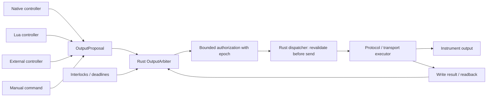
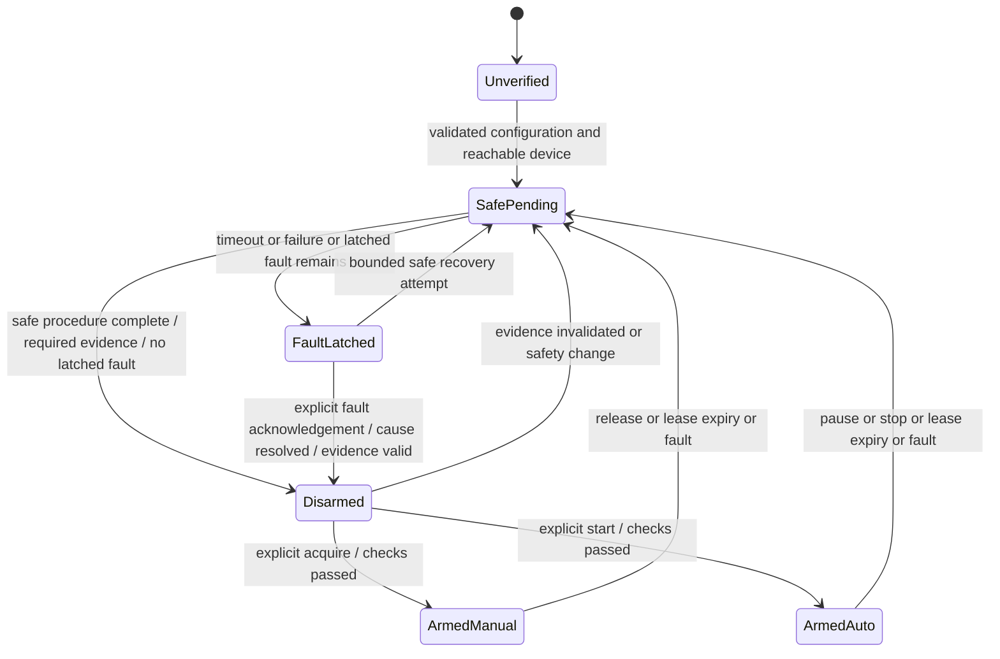

# Runtime, execution и output safety

Статус: архитектурное предложение. Общие сущности определены в [HIGH_LEVEL_ARCHITECTURE.md](HIGH_LEVEL_ARCHITECTURE.md), ограничения extensions — в [EXTENSION_MODEL.md](EXTENSION_MODEL.md). Здесь определены обязательные semantics будущей реализации; соответствие им ещё должно быть проверено POC.

## 1. Владение и модель исполнения

Runtime — отдельный headless process, запущенный независимо от GUI/Babashka. Coordinator сериализует изменения topology/configuration/lifecycle, но не выполняет внутри обработки commands блокирующий I/O, storage, скрипты или долгие queries. Каждый mutable domain aggregate имеет одного владельца; worker results применяются через сообщения с instance generation. Общий mutex вокруг всего эксперимента не является моделью исполнения.

| Область | Кто исполняет и чем владеет | Граница изоляции |
| --- | --- | --- |
| Commands и experiment state | Coordinator: registry, revisions, lifecycle, маршрутизация | Ограниченная очередь; нет ожидания client callback или I/O в критическом обработчике |
| Physical transactions | Rust executor на конфликтующий resource, например COM/RS-485 bus | Собственная очередь и deadlines; один обмен на serial resource; ошибки одного порта не блокируют остальные |
| Native processing / controllers | Runtime-managed execution lane, bounded jobs, monotonic ticks | Не разделяет blocking worker с Lua/recorder/IPC; overruns видимы watchdog |
| Safety | Rust arbiter и watchdog с короткими bounded обработчиками | Отдельное обслуживание приоритетных safety requests и deadlines; не ожидает Lua/GUI/storage |
| Lua | Опциональный host с ограниченными workers/VM | Очереди, budgets, generation; зависший script не удерживает native execution lane |
| IPC clients | Отдельные session/subscription handlers | Пер-клиентские quotas; медленный получатель теряет telemetry/gaps или отключается |
| Recorder | Runtime-owned writer | Ограниченная очередь, независимый disk I/O, явная health/durability граница |
| GUI | Клиентский процесс | Закрытие окна не завершает Runtime |

Это логические lanes, не требование по одному OS thread на объект и не детальный Tokio design. Физическое отделение blocking work и возможность обслуживать safety при загруженном Lua обязательны; конкретный executor выбирается по POC. Native code остаётся доверенным: task boundary не изолирует process crash или произвольный бесконечный native loop.

### Scheduling и время

Monotonic clock задаёт dt, TTL, leases, deadline и reference progress. Wall-clock нужен для сопоставления истории, его корректировка не продлевает lease. После restart создаётся новый Runtime epoch; старые monotonic timestamps и полномочия недействительны.

Acquisition создаёт bounded transaction requests, новые samples распространяются по проверенному DAG, controller tick берёт пригодный snapshot inputs/reference. Пропущенные ticks не исполняются бесконечным burst «догоняющих» воздействий. Controller получает фактический dt; превышение допустимого gap переводит контур в fault/safe policy. Временное рассогласование нескольких входов проверяется явно.

Admission учитывает длительность и частоту polling/writes на общей шине, budgets вычислений, timeout, freshness и допустимое время реакции. Если worst-case bounded transaction уже длиннее safety budget, повышенный приоритет очереди этого не исправит: configuration непригодна без другого транспорта/аппаратной защиты. Числа выбираются по установке до физического управления, не выдумываются на архитектурном этапе.

Safety priority действует между транзакциями. Начатая write может завершиться после отзыва lease; software cancellation не отменяет физический эффект уже отправленных байтов. После такого обмена требуется reconciliation и safe action. При неопределённом времени исполнения прибора программной гарантии safe state недостаточно.

### Ограничение нагрузки

| Поток | Поведение при перегрузке |
| --- | --- |
| Client telemetry / GUI plots | Coalescing/downsampling или gap с cursor; медленный клиент не удерживает acquisition |
| Client commands | Admission/rate limits, bounded queue, явный busy/rejected; accepted commands не теряются молча |
| Signal processing | Bounded windows/queues; node объявляет latest-value или every-sample semantics. Потеря обязательного sample отмечается invalid/gap |
| Controller proposals | Одна актуальная pending цель на канал, где это разрешает операция; устаревшие superseded proposals отмечаются. Неидемпотентные actions не coalesce |
| Critical safety requests | Отдельная зарезервированная capacity и fault flag/coalesced safe request; внешний flood не должен вытеснить disarm/watchdog |
| Recorder | Буфер ограничен; при исчерпании — recording fault и policy с остановкой затронутого управления, а не блокировка safety |

Ограничены также subscriptions, history reads, script diagnostics, число dynamic instances и размер metadata. Долгоживущая сессия не накапливает бесконечные history vectors, request deduplication entries и failed workers.

## 2. Output authority и доверенная граница

Единственный путь воздействия:

OutputChannel связывает физический actuator parameter/operation, safety profile, observed state, owner, lease, generation и последние request/ack/readback. Один logical owner на канал. Arbitrary priority contests и смешивание нескольких controllers в arbiter не нужны: сложная композиция происходит в одном controller, который выдаёт конечное предложение. Manual режим имеет ту же проверку, что automatic.

К output boundary относятся не только числовые `power.set`, но и enable, внутренний device setpoint, mode changes, calibration/reset и любые configuration operations с возможным влиянием на выход. Нет отдельного обходного write API. Maintenance выполняется после безопасной остановки и получает ограниченное разрешение на объявленную операцию; после потенциально изменяющей выход операции safety state снова проверяется до возврата к disarmed.

Физические операции используют проверенный operation catalog. Script не может изменить адрес/bytes/value после авторизации; trusted Rust dispatcher связывает разрешение с конкретной нормализованной величиной и операцией. Safety checks дополняют, а не заменяют правильность driver/definition. Native host, device mappings и safety profile входят в доверенную базу. Ошибочные показания скрипта не превращаются в надёжный protective interlock только от прохождения типов.

### Состав OutputProposal

Domain proposal содержит output ID, producer/instance generation, lease identity/epoch, sequence, desired value с units, основание (input/reference sequences), correlation ID и ограниченный срок пригодности. Authority сроков — monotonic clock Runtime; клиент не может назначить бесконечный TTL или продлить срок старого измерения своей timestamp. Повторный/запоздалый sequence не применяется.

### Проверка и применение

1. Проверить generation, active mode, owner, lease/heartbeat, proposal sequence и разрешённую operation capability.
2. Проверить качество, возраст и согласованность обязательных inputs/reference, recording health и interlocks. Для внешнего controller проверить ссылки на известные Runtime input sequences.
3. Проверить тип, units, конечность числа, device limits, более строгие limits установки и rate-of-change policy. Некорректный или вне-domain proposal отклоняется; допустимая рабочая saturation может ограничить величину с явным результатом. Эти два случая не смешиваются.
4. Зафиксировать decision и выдать доверенному dispatcher ограниченное разрешение на конкретное воздействие, с output epoch/deadline. Его срок не превышает ближайший предел lease, proposal TTL и пригодности обязательных inputs/reference. Это внутренний объект Runtime, не bearer token для клиента.
5. Непосредственно перед отправкой dispatcher снова проверяет epoch, deadline и актуальное разрешение safety, включая interlocks/fault/revocation. Старые queued writes удаляются/отклоняются при смене режима. Линеаризация отзыва относительно начала отправки должна быть проверена POC.
6. Отдельно опубликовать sent, acknowledged/failed/ambiguous и observed/readback. Вернуть controller фактически разрешённую цель и известный delivery status; это нужно, например, для anti-windup, а не для притворного подтверждения физического выхода.

Изменение safety-sensitive configuration увеличивает revision/epoch и не оставляет действующими старые permits. Переход manual ↔ automatic осуществляется через revoke → safe transition → новый owner. Бесшовная передача активного выхода не входит в v1.

Hard interlocks и safe action имеют приоритет над обычными ramp/slew constraints. «Safe» не обязательно равно нулю: для конкретной установки это может быть off, закрыть клапан или выполнить bounded последовательность охлаждения. Такой профиль должен быть заранее определён и исполним Rust независимо от отказавшего controller/script. Бесконечное удержание последнего значения не считается safe behavior по умолчанию.

## 3. Safety state machine

State machine задаётся на OutputChannel. Для связанных выходов safety policy задаёт область совместного fault/disarm; программная группа не гарантирует атомарности физических writes. Если safety требует одновременного воздействия, нужна соответствующая hardware/native protocol возможность либо отказ в допуске такой configuration.

Состояние полномочий и доказательство физического состояния хранятся раздельно. Evidence имеет уровень (unknown / command acknowledged / readback verified), время/возраст и источник. `Disarmed` означает отсутствие разрешения на обычное управление и успешное выполнение заранее согласованной safe policy с указанным уровнем evidence; это не универсальное утверждение о физической безопасности установки.

| Состояние | Разрешённое поведение |
| --- | --- |
| Unverified | После startup/restart/неизвестной identity: обычные writes запрещены; можно validate, probe и инициировать safe procedure |
| SafePending | Owner и старые permits уже отозваны; выполняются только разрешённые safe/recovery операции; controller proposals отклоняются |
| Disarmed | Нет output owner; safe evidence соответствует profile. Можно читать, конфигурировать при preconditions и явно запросить arming |
| ArmedManual | Один manual producer с lease, обычные proposals проходят все checks |
| ArmedAuto | Один зарегистрированный controller producer с lease; native/Lua/external origin не меняет final authority |
| FaultLatched | Управление запрещено, причина сохранена; safe output может быть подтверждён или всё ещё unknown. Recovery не включает автоматический rearm |

Interlock trip, failed/ambiguous write, controller/script failure и recorder-required failure ставят latch сразу при отзыве authority; затем запускается SafePending. По завершении safe procedure fault остаётся в FaultLatched. Обычный pause/release без fault может завершиться в Disarmed. Ни acknowledgement fault, ни reconnect сами по себе не возвращают Armed.

Evidence подтверждается только после завершения/урегулирования более ранних in-flight воздействий; поздний write не должен переопределить safe command после фиксации успеха. Если это нельзя установить, остаётся unknown/FaultLatched. При недоступном порте нельзя заявлять, что safe output достигнут. Выход из fault требует разрешения причины, актуального evidence и отдельного acknowledgement; start/acquire после этого — отдельное действие.

Если устройство не имеет readback, профиль может допускать только протокольное acknowledgement при заранее согласованной аппаратной защите и модели процесса. Это ослабленный уровень наблюдаемости, отображаемый клиенту; он не переименовывается в verified physical output. Без согласованного допустимого evidence profile arming запрещён. Фактические профили остаются вопросом для конкретного hardware.

## 4. Leases, disconnect и ownership

Lease выдаёт только Runtime. Он ограничен по времени, связан с producer generation/output epoch и отзывается при lifecycle/fault. Подтверждение живого соединения не заменяет execution health, свежесть inputs и proposals.

| Случай | Кто продлевает полномочия | Что происходит при disconnect/failure |
| --- | --- | --- |
| Native controller создан через GUI/Babashka | Runtime по своевременным успешным controller ticks и пригодным inputs | Закрытие клиента не влияет; сбой controller или stale dependencies отзывает lease |
| Lua controller | Runtime по принятым своевременным результатам; не просто по живой VM | Timeout/error отзывает lease; поздний результат недействителен |
| External controller | Зарегистрированная client producer session; heartbeat плюс пригодные timely proposals | Disconnect отзывает authority сразу после обнаружения, TTL ограничивает необнаруженный разрыв |
| Manual GUI/CLI producer | Та же client session с ограниченным lease | Закрытие/обрыв вызывает safe transition; «оставить последнее навсегда» не default |
| Babashka supervisory recipe | Не владеет выходом сама, если запускает native controller | Native loop продолжает; неотправленные шаги recipe не исполняются |

Default для runtime-owned эксперимента — продолжать работу без GUI/Babashka, пока все локальные условия пригодны. Если установка требует присутствия supervisor, это отдельный заранее настроенный interlock/lease dependency эксперимента. В таком режиме disconnect намеренно вызывает safe transition, а не уничтожает state. Клиент не может случайно менять этот режим своим временем жизни.

Reconnect создаёт новую client session, получает snapshot/дальнейшие events и состояние прошлых commands. Старые ownership tokens не наследуются; явный acquire возможен только после действующих checks. Несколько GUI могут наблюдать, но не конкурировать незаметно за один output. При занятости канала возвращается owner/busy; захват не вытесняет другого producer без явного безопасного перехода.

## 5. Controller lifecycle

| Переход | Algorithm state | Output / Reference semantics |
| --- | --- | --- |
| Creation → Created | Назначены ID, kind и generation; исполнения нет | Нет lease |
| Configure → Ready | Проверены inputs, output bindings, units, period, config revision; initial state | Нет воздействия; Reference задан отдельно |
| Start Ready → Running | Проверены warming-up/freshness, prerequisites и budget | Acquire новой authority только из допустимого safety state; безопасное начальное воздействие |
| Pause Running → Paused | Ticks прекращаются; private state сохраняется для inspection | Revoke и SafePending немедленно; Paused не означает, что hardware уже safe. Linked Reference pause только при явном ownership/configuration |
| Resume Paused → Running | По умолчанию reinitialize control memory относительно текущего measurement/разрешённой цели; не интегрировать длительность паузы | Новый lease и полная проверка. Reference продолжает по своему lifecycle. Старое high output не восстанавливается автоматически |
| Reset Created/Ready/Paused/Failed → Ready | Сброс algorithm memory после разрешения ошибки/валидации | Требует отсутствия active authority; не arming и не implicit Reference reset |
| Removal → Removed | Больше не планируется; освобождение после завершения/отсечения старых jobs | Сначала revoke; Runtime сохраняет output/fault state и доводит safe procedure даже после удаления controller |
| Failure Running → Failed | Сохранены причина и diagnostics; результаты generation инвалидированы | Revoke + latched fault + safe procedure; retry алгоритма не возвращает authority |

Start/Resume не является полностью выполненным действием, пока preconditions не пройдены; command outcome отражает отказ. Конкретный PID может поддержать bumpless initialization через свой validated native алгоритм; универсальное сохранение интегратора после произвольной паузы не обещается. Controller получает сведения об ограниченном выходе, чтобы не накапливать интегратор в предположении, что всё запрошенное было применено.

Furnace может иметь внутреннюю state machine и несколько bindings. Его предметные режимы предстоит определить при отдельном анализе v1; они не должны владеть портом или обходить arbiter. External controller имеет этот lifecycle в Runtime, даже если алгоритмическая память находится в другом процессе.

## 6. Recording и authoritative history

RecordingSession принадлежит Runtime. Перед началом фиксируются session identity, Runtime build/version, применённая configuration, definitions/scripts и их immutable versions/content, hardware identity и mapping logical IDs к physical channels, units, clock provenance, safety policy и recording policy. Изменения metadata записываются с revision и временем применения.

В историю входят measurement samples с quality, объявленные derived/control signals, actions/значимые rejected operations, controller/reference lifecycle, arbitration outcomes, ownership changes, requested/sent/acknowledged/observed outputs, errors и структурированные user/script events. Для output changes сохраняется причинная связь request → proposal → arbitration → transaction outcome → readback, когда он есть. Журнал должен отличать intent, факт отправки и наблюдённое воздействие.

Обязательные потоки recording выбираются до запуска. Диагностические proposals каждого tick можно записывать по отдельной policy; реальные output decisions/changes, конфигурация и safety transitions не зависят от sampling GUI. Экспорт и plot downsampling не изменяют исходную историю.

Writer принимает bounded batches и сообщает durable watermark. `Accepted by recorder` не равно `persisted`. После crash authoritative history заканчивается на последней подтверждённой durable границе; незавершённая сессия отмечается interrupted, а возможный хвост потери — явно неизвестным. Не обещаем, что каждый физический эффект успел попасть на диск перед power loss. Требование строгого write-ahead для обычного output, формат/flush interval и допустимый loss window выбираются до physical-control slice. Safe action никогда не ждёт fsync.

По умолчанию активное физическое управление требует исправного recorder. Disk full, I/O error или переполнение обязательной очереди вызывает latched fault и safe transition затронутого эксперимента; acquisition может продолжиться как явно degraded диагностика в ограниченных buffers. Опциональный режим продолжения без durable recording допускается только как заранее заданная policy конкретного эксперимента, не молчаливый fallback. POC использует обязательную запись.

Failure recorder может сделать невозможной запись собственного fault. Runtime всё равно меняет safety state, хранит bounded emergency diagnostics в памяти, сообщает их доступным клиентам, отмечает interrupted/gaps при следующем доступном сохранении. Нельзя гарантировать долговременный fault event на полностью недоступном storage; это ограничение видно в session outcome.

Retention, ротация и свободное место проверяются заранее и во время работы. Runtime не удаляет молча authoritative history ради продолжения эксперимента. Архивный формат и политика удаления — отдельное решение. Автоматическое восстановление controllers из журнала не требуется: история не является complete event-sourced runtime snapshot.

## 7. Failure model и recovery policy

| Отказ | Обнаружение и владелец recovery | Поведение и условие возврата |
| --- | --- | --- |
| Serial transport fails | Transport executor: OS error/transaction deadline; coordinator управляет bounded reconnect/backoff | Все instruments этой шины degraded/offline, старые transactions инвалидированы; затронутые outputs safe-pending/fault с unknown evidence. Другие порты работают. После reconnect identity/framing проверяются, rearm только явно |
| Instrument goes offline | Instrument health и sample freshness при живом bus | Отказ scoped к прибору/зависимым контурам; stale values не скрываются. Retry только разрешённых операций; safe action при возможности, иначе unknown/fault |
| Lua extension throws | Host фиксирует error и generation | Instance failed; dependent samples invalid, controller authority отозвана. Независимые native paths продолжают; reload/recovery не rearm |
| Lua extension hangs | Instruction/memory budget и внешний deadline watchdog | Результат просрочен, instance quarantined, old outputs отвергаются; native/safety lanes продолжают. Непрерываемый host call — дефект isolation, не допустимое нормальное поведение |
| Babashka disconnects | IPC session + lease timeout | Supervisory native state продолжает; external/manual authority отзывается. Recipe future steps не исполняются; после reconnect resync |
| GUI closes | IPC session | Runtime/recorder/polling продолжают; manual lease прекращается, если GUI им владел |
| Controller fails / misses deadline | Scheduler и arbiter health/deadline | Failed, revoke, latched safe transition; stale queued/in-flight handling обязательно. Повторный start только после устранения причины |
| Recorder fails | Writer health, watermark lag, queue/disk bounds | По default fault и safe transition управляемой сессии; без ожидания диска в safety lane |
| IPC client is slow/flooding | Session quotas, output queue/cursor lag | Telemetry gap/coalesce/disconnect, новые commands busy/rejected; acquisition/контроль не ждут клиента |
| Write timeout / ambiguous completion | Transaction executor и protocol adapter | Нельзя считать, что write не случился. Revoke ordinary writes, invalidate queued permits, reconciliation/safe action; retry только с явно разрешённой семантикой |
| Interlock input stale/invalid | Rust safety input validation | Fail-closed: interlock считается неудовлетворённым, safe transition и latch. Применяется к заданной dependency group |
| Runtime graceful shutdown | Runtime coordinator/safety | Последовательность ниже; выходы блокируются раньше остановки I/O/recorder |
| Runtime crash / OS/power failure | Вне возможностей живого процесса; обнаруживается аппаратной защитой или при следующем startup | Software safe command может не выполниться. Hardware watchdog/interlock требуется по риску установки; restart не восстанавливает active leases |

Recovery policy находится у владельца слоя: transport восстанавливает канал, instrument проверяет identity/protocol state, host восстанавливает extension, coordinator управляет experiment lifecycle, arbiter единолично решает пригодность выхода. Повторные попытки имеют предел/общий deadline и backoff; выздоровление нижнего слоя не означает разрешение автоматического управления.

## 8. Shutdown, restart и многодневная работа

Graceful shutdown — отдельная Runtime command/сигнал завершения процесса, а не побочный эффект закрытия GUI:

1. Перейти в stopping, отклонить новые start/acquire/configuration mutations; сохранить доступ к status и безопасному завершению.
2. Отозвать output authority, увеличить epochs, прекратить controller proposals и обычные polling/writes, мешающие safe sequence. Сохранить необходимые safety reads.
3. Удалить устаревшие queued writes; ограниченно дождаться/урегулировать in-flight transactions. Выполнить Rust-owned safe procedures и получить required evidence, пока I/O ещё доступен.
4. Зафиксировать per-output confirmed/unknown/failure outcome. Не выдавать «успешное безопасное завершение», если дедлайн истёк или evidence недостаточен.
5. Остановить прочие acquisition/jobs, завершить запись с bounded flush и session outcome; затем закрыть transports и host. Shutdown имеет общий deadline, outcome может быть incomplete.

Safety и flush deadlines не должны превращать shutdown в бесконечное ожидание. Принудительное завершение/потеря питания оставляет риск физического выхода, который не решается архитектурой программы. Это особенно существенно для heater/flow/pressure actuators с удержанием последнего значения; аппаратный профиль определяется до их допуска.

Startup после штатного или аварийного завершения загружает configuration, восстанавливает доступную историю и обозначает прошлую незавершённую сессию. Состояние outputs начинается Unverified, polling/controller windows заново прогреваются, identity и safety profile проверяются. Даже safe command нельзя вслепую отправлять неизвестному устройству на переиспользованном адресе: требуемая profile проверка соответствия physical binding предшествует воздействию. Если прибор не предоставляет надёжной identity, допустимый способ проверки подключения определяется для установки; несовпадение оставляет fault/unknown. Продолжение активного управления — явное действие после reconciliation; сохранять конфигурацию не означает сохранять live lease.

Для часов/дней работы нужны ограниченная память/очереди, проверка recorder lag/disk space, наблюдаемость execution latency/deadlines и connection health, bounded reconnect и ротация. Lifecycle clients независим от Runtime. Внешняя процедура, которую требуется продолжать после падения Babashka, либо заранее выражается через Runtime Reference/Program и native controllers, либо отдельно проектирует свой checkpoint/recovery; автоматического durable workflow engine в v1 нет.

## 9. Инварианты для будущей проверки

- Ни одна физическая side-effect operation не достигает dispatcher без актуального разрешения arbiter; это относится и к альтернативным register mappings/configuration actions.
- У канала не больше одного owner; reconnect/reset/reload не оживляют старые leases и результаты.
- Failed/expired write не выдаётся за подтверждённый safe output. Safe evidence актуально только после урегулирования возможных поздних воздействий.
- Slow client, recorder или Lua не выполняются на пути ожидания native tick/safety decision. Непригодные inputs вызывают явный fault, а не бесконечное использование старого значения.
- GUI/Babashka disconnect не уничтожает experiment, native controllers и recording session. External/manual lease loss имеет отдельную ожидаемую safe semantics.
- Состояние и история различают requested, authorized, sent, acknowledged, observed и durable; никаких скрытых exactly-once/physical-safety обещаний.

POC acceptance scenarios для этих инвариантов определены в [POC_PLAN.md](POC_PLAN.md). Решение закреплено в [ADR-0002](../adr/0002-central-output-authority.md).
