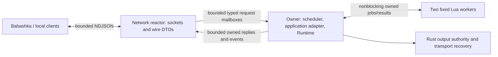

# Milestone 6: autonomous host and local Babashka control

Status: **DESIGN COMPLETE; waiting for the user to switch ASTRA_HIGH -> SOL_HIGH.**
This is an implementation contract, not evidence that M6 works. No M6 production
code or dependencies were added during this design phase. M7 is outside scope.

## 1. Baseline, scope and decisions

The externally approved M4 correction/M5 implementation is commit `cb98d55`:
92 tests at the corrected M4 gate, 123 at M5. Astra reran all 123 workspace tests
and workspace/all-target clippy with warnings denied successfully. README and
AGENTS were synchronized first in `aaca40f`; incoming reviewer approval and the
Astra mandate are preserved in `a8c68ff`. Review approval was based on supplied
source/evidence, not an independent Cargo run by the external reviewer.

Read the [M4 lifecycle contract](MILESTONE_4_LIFECYCLE_REVIEW.md),
[M5 design](MILESTONE_5_DESIGN.md) and their reports before implementing this
contract. They remain authoritative for authority, Warming, finite native renewal,
observation freshness, Lua budgets, worker quarantine and generation fencing.
The architecture and migration documents inform boundary choices; they do not
authorize future target features. No donor code or dependency is needed.

M6 supplies a long-running, virtual-only Rust host; an explicit monotonic scheduler;
a bounded local TCP/NDJSON adapter; query/command/outcome semantics; bounded ordered
subscriptions and reconnect; and a real Babashka process proving autonomy. The
default finite M1 executable behavior remains available unchanged. Add an explicit
`--serve --profile virtual-demo --port <port>` mode; port 0 requests an ephemeral
port. Bind only IPv4 `127.0.0.1`, rejecting other bind addresses.

Decisions fixed here:

- One thread owns Runtime and serializes domain changes. One bounded nonblocking
  network reactor owns all client sockets. Existing two Lua workers stay isolated.
- Use std threads, nonblocking sockets and bounded channels, with no Tokio or new
  micro-crate. Core remains std-only; JSON and protocol types stay in the host.
- Clients configure existing native PID/Ramp instances from a trusted startup
  profile. No remote arbitrary registration, script deployment, raw transport,
  manual output, evidence injection or client-controlled scheduler time.
- Live Ramp retuning preserves continuity. PID gains/limits change only in Ready
  or safely Paused; the same domain validator serves local and network callers.
- Server-issued session scopes and monotonic operation numbers make bounded
  deduplication honest after eviction. No durable exactly-once claim.
- A frozen bounded snapshot and event cursor are captured in one owner action.
  Retention loss is explicit; slow subscribers are disconnected.
- Shutdown first fences producers and drives Rust safe/recovery work, then closes
  transports and waits a bounded time for workers. Missing safe evidence is failure.

No Recorder/SQLite, GUI, COM adapter, physical actuation, long soak, authentication,
TLS, Internet endpoint, nREPL server, orchestration engine, Lua controller or
Babashka feedback loop is introduced. Native extension remains ordinary Rust
composition/recompilation. The native virtual loop is the closed-loop proof;
Lua source/transform remain read-only model observations.

## 2. Ownership and implementation boundaries



The owner constructs Runtime in its own thread; do not force existing
`ByteTransport` implementations to become Send or wrap Runtime in a shared mutex.
In production the main thread may be that owner. Network code receives plain,
validated request values and owned result copies, never Runtime references,
leases with usable authority, executor handles or a blocking Runtime lock.

Use host modules for scheduler, service/application mapping, protocol, sessions,
events, network and startup/shutdown. A host library is justified to exercise the
same composition from tests and the binary. These are modules in lab-runtime,
not new framework crates. Add only host-side serde/serde_json, an OS entropy
dependency for a 128-bit boot identity, and a small cross-platform Ctrl-C adapter
if needed. Sol records selected versions/features in the lockfile and report;
there is no dependency change in this design commit. Signal handling only sets a
shutdown flag and wakes the owner; it never calls Runtime or waits on a lock.

Connection mailboxes are fixed slots. Each slot has a checked generation; reuse
requires owner acknowledgement of detach. Late traffic/results for an old
generation cannot reach a new connection. Detach is signalled in a separate
per-slot atomic state, so a full request queue cannot prevent cleanup. Shutdown
uses a separate atomic flag, not an ordinary full mailbox. All sends on the owner
are try-send; no JSON encoding, socket I/O, filesystem write, console logging,
sleep, callback or thread join occurs inside a domain service unit.

Minimal Core changes required by actual inspected source:

1. `RuntimeReference` currently only exposes internal evaluation; the public Ramp
   kernel can retune but Runtime has no evaluation/retune Command. Add narrow
   explicit-time Reference commands and configuration revision snapshots.
2. Add atomic PID gains/limits configuration with expected configuration revision
   and pure configuration queries. Preserve controller identity, bindings, timing,
   lifecycle and the existing private renewal path. Do not expose mutable kernels.
3. Add a nonblocking managed quiesce seam and executor shutdown status. Current
   `LuaSupervisor::request_shutdown` may wait 200 ms and is unsuitable on the owner
   while safe transport work is pending. Split begin/poll behavior, retaining the
   existing bounded convenience method for callers off the safety lane.

Avoid splitting the established safety service unnecessarily: `PollComponents`
already calls `ServiceSafety`, which polls every M3 resource once, before deadline
expiry and at most two completion validations. The schedule below accounts for
this nesting explicitly; it does not also poll every transport a second time.

## 3. Startup profile and hard bounds

The M6 host supports a deliberately bounded deployment subset of Core: at most
8 instruments, 16 parameters per instrument, 8 outputs, 8 controllers, 8 References,
8 managed components and 8 transport resources. Existing Core maxima and earlier
tests remain unchanged. The trusted profile is validated before the listener is
reported ready. Registration is not a network operation in version 1.

The standard profile registers a thermal plant, native EMA/PID, independent Ramp,
Lua model source and moving-mean transform. Bind a 0..100 percent safe profile,
safe value 0 with simulated readback required; establish safe evidence, prepare
the controller to Ready and start observation scheduling. No automatic Start.
Native extension seams are demonstrated by this composition, not by a plugin ABI.
Managed initialization is polled during startup with a 2-second total deadline;
failure prevents readiness and invokes the same shutdown path.

| Resource | Hard bound / overflow policy |
| --- | --- |
| Live TCP connections | 8; refuse excess connections without allocating a worker |
| Input and output NDJSON frame | 16,384 bytes including LF; one retained partial input frame per connection |
| JSON nesting / total values | 16 nested containers / 1,024 values and object members per frame; reject before unbounded construction |
| Identifier / operation name | 64 UTF-8 bytes; typed names are from a fixed allowlist |
| General incoming string / error message | 512 / 256 UTF-8 bytes; bounded field path, no echoed source/frame |
| Profile display label / description | 128 / 512 UTF-8 bytes; descriptor must fit one frame |
| Pending incoming requests | 8 per connection, 64 total; stop reading that connection when full |
| Owner external work | At most 4 requests per turn, at most 1 per connection, rotating starting slot |
| Reply mailboxes | 8 frames per connection, including the reactor's pending partial reply |
| Event mailboxes | 16 frames per connection, including pending partial event; at most 4 KiB per event |
| Subscription | 1 per connection; at most 16 target IDs and 8 event kinds in its filter |
| Event ring | 1,024 records, each at most 4 KiB; oldest-first eviction, no pinning |
| Session scopes | 16; idle scopes expire after 30 minutes only if detached and with no pending operation |
| Accepted nonterminal operations | 64 total, at most 8 per scope; never evicted while pending |
| Terminal operation results | 256 total, at most 32 per scope, 10-minute TTL; evict oldest terminal first |
| Operation record | At most 4 KiB normalized command + result/error each; v1 command shape is much smaller |
| Frozen snapshots | 1 per connection, at most 256 KiB accounted owned data, 5-second TTL; replace/release explicitly |
| Snapshot page | At most 8 KiB encoded records, within the 16 KiB response frame |
| Network sweep | At most 8 accept attempts; 8 KiB read and 8 KiB write per client; at most 4 parses/encodes per client |
| Network idle wait | At most 5 ms, interruptible for shutdown; never blocking socket reads/writes |
| Handshake / incomplete frame / no write progress | 2 s / 2 s from first byte / 2 s with unsent data, then close |

Bounds include items currently being processed, not only channel capacity. A
partial write counts against the originating reply/event quota. Replies and events
have independent queues; service replies first, then at least one event when both
exist, within the byte budget. Do not restart a partial frame or interleave its
bytes. Queue overflow disconnects the affected client via the detach flag; the
owner continues. A disconnected client's already accepted commands still execute.
Discard queued requests not yet accepted when detach is observed. No implication
about a request's outcome follows merely from observing a disconnect.

Snapshot accounting uses a conservative upper bound including owned strings,
arrays and worst-case JSON escaping, checked during profile validation. Snapshot
contents exclude histories, Lua source/config/state blobs and duplicate descriptor
text: include catalog identities, latest attempts, configs, controller/Reference/
component status, output evidence and scheduler status. Each record fits 4 KiB.
Pages contain whole records; a cursor advances by record index, not arbitrary byte
offset. Reject an oversized profile before activation, never truncate status.
Full descriptor queries also enforce the encoded bound before startup succeeds.

Keep bounded scratch buffers, session metadata and event projections; no second
unbounded collection for fingerprints, expired IDs, metrics, logs or subscribers.
Checked counters must never wrap: impending identity/event/revision exhaustion
stops admission and initiates safe shutdown with an explicit error.

## 4. Monotonic scheduler and overload policy

Use one `Instant` origin and elapsed `Duration` in production. A small injected
clock/wait seam supports deterministic tests; Core continues to receive explicit
time. Wall time never determines freshness, authority or ordering. Take a fresh
monotonic time before each domain call. Never pass client times or stale planned
deadlines as the actual time. Clamp neither backward time nor expired authority.

| Lane | Explicit period / admission rule in virtual-demo |
| --- | --- |
| Safety, M3 transport recovery, managed expiry/completion | 10 ms; one `PollComponents` service (safety first, max 2 completions) |
| Plant measurements | 100 ms; at most one refresh per due plant |
| Independent References | 100 ms; one evaluation per due Reference, including while a controller is Paused |
| Native controller service | 100 ms; one distinct-input update per due controller |
| Lua source Step | 200 ms; one attempt per due source, no admission when pending/Failed |
| Lua transform Step | Fresh upstream attempt, checked on 10 ms lane; at most one admitted transform per component per turn |
| External work and event delivery | After due domain work, bounded request budget and at most 4 event records per connection per turn |

Virtual-demo controller defaults: input age 500 ms, maximum tick gap 500 ms,
finite lease 2 s, proposal TTL 200 ms, EMA warm-up 3 distinct inputs. The output
safe profile permits a 2-second lease and 200-ms proposal. These are validated
durations with margins; max_tick_gap is a failure threshold, never a scheduling
period. Lua-dependent fixtures may use a 200-ms controller period and 750-ms
age/gap, with a 2-second lease. M5 worker admission deadlines remain unchanged.

Each turn: observe shutdown; service due safety/completions; refresh due native
measurements; evaluate due References; service due controllers; try due managed
admissions fairly; handle bounded client work; offer bounded event replay. Rotate
within equal-priority lists. Before each unit, if safety is now due, return to the
top of the loop. A single bounded Core call may overrun the nominal period;
immediately service safety next and record lateness. Network/Lua cannot hold that
call open. Do not drain any queue to empty on this lane.

Safety uses the combined service once per due slot; do not separately call
PollTransports or PollComponents again in the same slot. With no executor installed,
the same service still checks authority and progresses M3 resources. During
shutdown use ServiceSafety without accepting new managed publications.

Advance due time from its prior deadline: after one opportunity at actual `now`,
`next_due += (1 + floor((now - next_due) / period)) * period`, with checked
arithmetic. Missed plant/reference steps coalesce into one at actual time; the
plant and Ramp use elapsed-time mathematics. Missed PID slots are skipped, never
replayed against old input. If the gap or input is already unsafe, the preceding
safety pass fails the controller before another output. Busy Lua admissions skip
the slot without retry accumulation. No catch-up loop or permanently hot retry.

For Running controllers, a due slot without a distinct input does not call Tick
on the repeated sample and does not update last_tick, algorithm memory or lease.
Safety still enforces the original input age and tick-gap limits. A new sample at
a subsequent slot can progress only inside those limits. Distinctness includes
the existing source-time/generation/quality semantics, not merely value inequality.
Warming never acquires output before its configured distinct Good count. A failed
or unavailable attempt must reach safety even if its timestamp equals the previous
Good attempt. Managed completion time cannot freshen its upstream observation.

If due domain work consumes the turn, defer client work. A nominal 2-ms client-work
budget is checked between requests, in addition to the four-request cap; it cannot
preempt one operation. The host profile bounds that operation's work. If no work
is runnable, wait until the earliest deadline, with a 5-ms maximum wake interval.
The host is not a hard real-time system: measure service lateness and fail safely
after a scheduling stall; do not claim OS scheduling guarantees.

## 5. Domain operations and configuration semantics

The version-1 API has the following complete operation set. All target IDs refer
to existing instances, discovered by descriptors/roles rather than magic names.

| Kind | Operations | Meaning |
| --- | --- | --- |
| Protocol/session | `hello` | Version/capabilities and create/resume a session scope |
| Pure domain queries | `discover`, `describe`, `latest`, `controller`, `reference`, `component`, `output`, `runtime_snapshot` | Owned committed state only; no refresh, evaluation, polling or timer advancement |
| Session queries | `operation_status`, `snapshot_page` | Retained outcome / immutable page; no domain effect |
| Subscription control | `subscribe`, `unsubscribe`, `snapshot_release` | Session metadata only; never produces a domain sample |
| Domain commands | `reference_retune`, `controller_configure_pid`, `controller_start`, `controller_pause`, `controller_resume` | Validated serialized Core operation |
| Host lifecycle | `runtime_shutdown` | Accepted operation initiates the shutdown state machine |

Wire argument/result shapes are fixed as follows. Every request has an `args`
object; empty means `{}`, not omitted. Unknown keys are rejected at every level.

| Operation | args fields | result content |
| --- | --- | --- |
| `hello` | `scope`: null or previously issued scope string | Session/version/capability fields in section 6 |
| `discover` | empty | `instruments`, `controllers`, `references`, `components`, `outputs`: bounded identity/role/kind summaries in ID order, no full nested descriptors |
| `describe` | `instrument` | ID/name and parameter descriptors: identity, name, unit, value type/bounds, access, role, write effect, optional signal and safe capability |
| `latest` | `signal`: `{instrument,parameter}` | Latest attempt or null; value, quality, observation/publication times where distinct, unit and source generation |
| `controller`, `reference`, `component` | Respectively `controller`, `reference`, `component` ID | Current typed status and public config/revision; component includes kind, generation, pending and bounded diagnostic summary, excludes guest source/state blobs |
| `output` | `actuator`: `{instrument,parameter}` | Authority state/owner/epoch/finite expiry, fault, requested/sent/ACK/readback and required/obtained safe evidence; no executable token or adapter handle |
| `runtime_snapshot` | empty | Frozen token/cursor/first page/count/expiry, as section 8 |
| `snapshot_page` | `snapshot`, `index` (canonical decimal next record index) | Same token/cursor, records, next_index or null; no live substitution |
| `snapshot_release` | `snapshot` | `released` boolean; stale release cannot remove a newer snapshot |
| `subscribe` | `after`: `{boot_id,seq}`, `filter`: `{kinds,targets}` arrays | Subscription ID, accepted cursor; reject a second subscription until unsubscribe |
| `unsubscribe` | `subscription` | `removed` boolean; unknown old ID cannot remove another subscription |
| `operation_status` | `request_id`: `{scope,seq}` | Retained state/result/error or outcome_unknown |
| `reference_retune` | `reference`, `expected_revision`, `target`, `rate` | Committed reference/revision/value/target/rate/unit and `committed_at` |
| `controller_configure_pid` | `controller`, `expected_revision`, `pid`: `{kp,ki,kd,output_min,output_max}` | Committed controller/revision/config and lifecycle |
| `controller_start`, `controller_pause`, `controller_resume` | `controller` | Committed lifecycle plus output safe status where relevant |
| `runtime_shutdown` | empty | Terminal per-output safe status and cleanup status, as section 9 |

Snapshot/subscription tokens use the boot identity plus checked owner-issued
counters and belong to the connection generation; reconnect creates new ones.
Event filter targets are `{kind,id}` for instrument/controller/reference/component
or `{kind,instrument,parameter}` for signal/output. Empty target/kind lists mean
all targets/kinds. Unknown kinds or malformed ID shapes fail admission. Result
enum strings use documented snake_case names (including sample qualities and
lifecycle), with golden wire fixtures in H8–H10; never Rust Debug formatting.
No enum variants absent from the implemented Core contract are invented.

No wire operation maps arbitrary Rust Command/OutputCommand enum values. In
particular, `Automatic(controller_id)` is diagnostic data, never a credential.
No generic `call`, raw writes, output acquire/renew/propose/complete, fault-evidence
injection, remote Lua source or client-supplied elapsed time is accepted. A Failed
controller's reset/fault acknowledgement remains a trusted local capability in
M6; the API reports it as unsupported rather than silently resuming it.

Pure query handlers use committed owner state without invoking ServiceSafety.
Ordinary concurrent scheduler progress may change successive observations; tests
of query purity freeze the clock and scheduler. Register/refresh/evaluate actions
remain Commands, even when their results resemble query data. Snapshot allocation
and subscription metadata do not mutate the domain or evaluate a Reference.

Add a Core configuration revision for each Reference/controller, initialized to 1.
Only successful configuration changes increment it; ticks, snapshots, start/pause
and lease renewals do not. Commands require `expected_revision`. A mismatch fails
with `revision_conflict` and the current revision. Use checked arithmetic and
validate the entire candidate before committing. No host-only revision that local
Core callers could bypass. Existing constructors retain their domain validation.

`reference_retune` accepts only existing Ramp ID, finite target, strictly positive
finite rate and expected revision. At actual owner time evaluate the old Ramp on
a candidate, then retune from that exact current value; commit atomically with
the revision. Preserve identity/unit and PID memory. No jump at retune time; later
progress follows the new slope, also while the controller is Paused. Reference
evaluation and query do not alter configuration revision. Fixed retuning is not
advertised in v1; querying both Fixed and Ramp is supported.

`controller_configure_pid` replaces the full five-field gain/limit value, not a
partial patch: kp, ki, kd, output_min, output_max. Allowed only in Ready or Paused,
with no held lease, no pending actuator delivery, no fault and confirmed safe
output. Validate finite kernel values and ordered limits within both actuator
descriptor and bound safe-profile limits using shared Core logic. Preserve input,
output, Reference, EMA policy and timing settings. Commit a reset EMA/PID memory,
clear previous tick/output diagnostics, preserve Ready/Paused, increment revision;
it never starts output. Rejected configurations change neither configuration nor
algorithm memory; a separate normal watchdog tick may still advance safety.
Configuration while Created/Warming/Running/Failed fails explicitly. Running
retuning is through the Ramp only; pause, configure, resume for PID gain changes.

Start from Ready and Resume from Paused enter the existing Warming contract.
Their operation completes when that transition commits, **not** when Running or
temperature convergence occurs. Query/subscription reports later Warming/Running
or failure. Pause completes only with revoked authority and required safe evidence;
for the supported virtual output that evidence comes from Rust simulated dispatch.
Do not treat a state label or a queued safe request as safe confirmation.

## 6. Versioned NDJSON wire contract

Version is integer `1` in every frame. Requests are one UTF-8 JSON object plus LF;
accept optional CR before LF within the size limit. Reject invalid UTF-8, duplicate
keys, trailing data, unknown fields, nonfinite numbers, unsupported versions,
unknown operations and wrong types. Empty lines are malformed. Implement a
bounded lexical/depth check and strict typed decoding; default recursive JSON
parsing alone is not a depth/allocation policy. No panics or input echo on errors.
An incomplete frame's absolute deadline is not extended by trickled bytes.

Wire IDs, revisions, operation sequence, event sequence and monotonic nanoseconds
are decimal strings (u64 range, canonical spelling, no sign/leading zero except
`"0"`). Boot identity is 32 lowercase hexadecimal characters from OS entropy,
created before activation; entropy failure prevents startup. Target IDs are
scoped by boot identity, and signals/actuators are instrument/parameter pairs.
Finite engineering values are JSON numbers; unavailable value is null with an
explicit quality. Units use stable domain identity and symbol, not Rust Debug text.

`msg_id` is a connection correlation string, up to 64 bytes, unique among that
connection's pending exchanges. It is not the dedup key. A reused pending msg_id
is a protocol error. Commands additionally carry `request_id` with session scope
and operation sequence. Each complete parsed request is either rejected before
admission or considered by the owner in connection order. Parsing itself has no
successful mutation acknowledgement.

Illustrative frames (IDs below stand for values obtained from hello/discovery):

```json
{"v":1,"msg_id":"h1","op":"hello","args":{"scope":null}}
{"v":1,"msg_id":"q1","op":"latest","args":{"signal":{"instrument":"1","parameter":"1"}}}
{"v":1,"msg_id":"c1","op":"reference_retune","request_id":{"scope":"boot:1","seq":"1"},"args":{"reference":"1","expected_revision":"1","target":45.0,"rate":2.0}}
{"v":1,"msg_id":"c1","type":"operation","request_id":{"scope":"boot:1","seq":"1"},"state":"accepted"}
{"v":1,"msg_id":"c1","type":"operation","request_id":{"scope":"boot:1","seq":"1"},"state":"completed","result":{"reference":"1","revision":"2"}}
```

Actual scope format is `<32-hex-boot-id>:<checked-decimal-scope-counter>`; `boot:1`
above is abbreviated documentation notation. Examples are structural contracts,
not permission to accept abbreviated identities or assume parameter 1 is temperature.

Hello response contains boot_id, v, exact implemented operation/capability lists,
scope, next operation sequence, limits, event oldest/latest cursors and service
state. It reports virtual evidence honestly and no Recorder/hardware/manual-write
capabilities. Require hello first on each connection. Version incompatibility or
malformed framing yields a bounded error if possible, then close that client;
unknown op/invalid args after valid framing yields a correlated error and may keep
the connection. Hello itself does not grant output privileges or authenticate.

Query responses have `type:"result"` and `result`; protocol/admission rejection
has `type:"error"`, `code`, bounded `message`, optional bounded `field`, and
`accepted:false`. Command frames have `type:"operation"` with accepted/completed/
failed state and request_id; failure includes a stable error code, not Rust enum
discriminants. `operation_status` returns accepted/completed/failed/outcome_unknown.
An unknown outcome is epistemic, never proof of cancellation or non-execution.
Domain result includes current revision/state and an event cursor when applicable.

Register the accepted record before dispatch and publish its accepted response
before a terminal response on a healthy connection. For immediate operations both
may be produced in the same turn. Terminal outcome is stored before attempting
delivery; failed sends cannot roll it back. Pending commands have at most a
2-second owner admission-to-terminal deadline. An unexecuted expired command
fails `expired_before_execution`; an operation with unresolved execution/evidence
is not mislabeled as unexecuted. Shutdown has the dedicated bound in section 9.

## 7. Deduplication, ordering and lost replies

The owner allocates scopes only through hello with null scope. A returning client
supplies the old boot/scoped identity; the server resumes it if retained. Unknown
or previous-boot scope is rejected `scope_unknown` / `instance_changed`; it is
never silently created or replayed. Client may explicitly create a new scope
after reconciling Runtime state. Scope identity is a coordination mechanism, not
authentication. One live connection per scope; a second live attachment fails
`scope_in_use`. Different scopes support simultaneous clients.

Each scope stores a high-water accepted sequence starting at 0. A new command
must use exactly high_water + 1. At owner admission reserve a bounded pending
record containing normalized command and expected revision, increment high_water,
then execute. Capacity/shutdown/schema rejection before acceptance does not
advance it. Domain validation after acceptance may produce a retained failed
outcome and does consume the number. Clients can pipeline consecutive commands
within capacity; admission and execution follow their connection order. Across
connections the owner's fair dequeue order is the only total order; no ordering
claim is made about send times on different sockets. Revisions resolve races.

| Received command ID | Required action |
| --- | --- |
| Retained ID, equal normalized typed command | Return current retained outcome; do not execute again or extend retention |
| Retained ID, different command/args/revision | `request_id_conflict`; leave original outcome and domain unchanged |
| Sequence <= high_water, record evicted | `outcome_unknown`; never execute that ID again |
| Sequence > high_water + 1 | `sequence_gap`, not accepted |
| Unknown/expired scope or previous boot | Explicit unknown/instance-change result; no execution |

Payload equality compares bounded normalized typed values, excluding msg_id and
connection identity, including operation, all arguments and expected revision.
Reject duplicate JSON fields before normalization. Object key order and equivalent
JSON numeric spelling do not create different commands; normalize negative zero
to zero, reject nonfinite/overflow. Store the typed command, not a weak hash as
the only conflict proof. Unknown evicted payloads cannot be compared and always
return unknown, regardless of whether a supplied replacement differs.

On terminal retention pressure evict oldest terminal records and keep scope
high_water. Never evict a pending record. Expire detached idle scopes after 30
minutes; no unknown scope can be recreated by a command, so no unbounded tombstone
set is required. Reject creation when all 16 scopes are in use/not expired.
Terminal status lookup for an unaccepted or evicted ID also returns unknown; do
not advertise a permanent `never_executed` oracle. Retries do not refresh terminal
TTL; normal valid session activity refreshes the detached-scope idle clock.

A write completing on the client is not server admission. EOF, timeout or a killed
client may hide accepted/completed work. Reconnect, resume the same scope, query
operation_status or resend the identical retained command, and reconcile a fresh
snapshot. Never automatically assign a new request ID to an uncertain mutation.
After restart boot identity, scopes, event sequence and Runtime state are new;
nothing resumes or rearms automatically and no durable recovery is promised.

## 8. Semantic events and coherent recovery

The owner maintains a bounded semantic projection of committed state and appends
selected changes after **each** domain command/service unit, including one that
returns an error after changing state. Project latest attempt (including quality,
generation and observation time), controller lifecycle/latest PID diagnostic,
Reference value/config revision, component status/generation, output authority
and evidence, plus operation terminal outcome and host lifecycle. Compare full
relevant values, not timestamp alone. No event for unchanged pure queries.

This is a host projection of useful committed facts, not a mirror of every
internal mutation. Several internal transitions within one Core call can yield
one resulting state event; the domain result/evidence retains what that call
actually established. Configuration command and its resulting projection are
captured before the next command runs, so a rapid retune/pause cannot disappear
behind a once-per-turn diff. Use deterministic kind/ID order within a batch;
terminal operation event follows its resulting state events. Do not serialize
Rust internal structs, Lua source or physical evidence supplied by a client.

Every event has v, boot_id, globally increasing seq, owner monotonic publication
time, kind, typed target, bounded data and optional causing request_id. Observation
time remains a separate field. Sequence orders committed publication, not physical
occurrence or durable storage. Keep the semantic facts language-neutral so a
later Recorder can consume them; this wire DTO is not a persistence schema and
M6 does not design storage, transactions or replay from disk.

`runtime_snapshot` atomically captures the complete bounded public projection and
current cursor S on the owner, before any subsequent domain mutation. Return a
snapshot token, S, first page, record count and TTL. `snapshot_page` returns only
that frozen version until released/replaced/expired. All pages carry the same
boot_id/S; never fetch live data for later pages. A page request after expiry
returns `snapshot_expired`; client discards the partial snapshot and restarts.

After installing the complete snapshot, call `subscribe` with `after:S` and a
filter. Owner admission checks boot and ring range and creates a subscription
with the next sequence to scan. If S is within retained history, scan all records
after S, then continue live using that same scan position. No handoff between
separate replay/live paths with an event-loss window. If S+1 has been evicted,
return `event_gap` with oldest/current cursor and `resync_required:true`; no partial
success or silent jump. A future cursor fails `invalid_cursor`. Cursor 0 means
before first event only while that range is retained.

Filters select fixed event kinds and optional target IDs. The scan cursor advances
over nonmatching events too; send bounded `subscription_progress` frames carrying
the scanned-through cursor when filtering produces no events. Client commits a
cursor only after applying every preceding event/progress frame in stream order.
Operation events are filterable by kind and scope; they are not an access-control
boundary. Replay scanning is capped at 32 ring records per connection per turn,
with at most 4 matching offers. Detect eviction before each scan; if it occurs
during replay, send gap if room permits and detach. Ring history is never pinned
by subscriptions or snapshots. Slow-client egress overflow disconnects immediately;
best-effort final error delivery is not required for closure to be observable.

On reconnect, re-create the subscription from the last fully applied cursor.
Duplicates at the client are harmless when discarded by boot/sequence. A gap,
expired snapshot or changed boot requires a complete new snapshot and subscription
barrier. Current state recovery does not reconstruct missed historical events.
Client disconnect/subscribe/unsubscribe never pauses a controller or changes
finite native renewal. Remote reads stay responsive when both Lua workers stall.

## 9. Shutdown, failures and evidence

Startup order: validate CLI/profile and allocate boot identity; construct Runtime
and workers; bind safe profiles and prove the virtual outputs safe; initialize
managed components by bounded polling; prepare native controllers; bind the
loopback listener; publish one bounded JSON readiness line on stdout containing
boot_id, bound port and `state:"ready"`; then enter autonomous scheduling. Emit
readiness before accepting Start. No recurring owner stdout/stderr writes.
Tests consume that line with a deadline; a readiness timeout is failure, not a
reason for an arbitrary startup sleep. A bind/init failure cleans up safely.

Shutdown is one owner state machine, triggered by Ctrl-C, `runtime_shutdown`,
fatal scheduler/identity error, or unexpected network reactor exit. A single client
disconnect is not a shutdown trigger. The stop flag is checked before producer
admission and between bounded work units; normal OS callback only sets the flag.

1. Enter Stopping; stop new connections/mutations, scheduled plant/controller
   production and new Lua invocation. Fail accepted but unexecuted ordinary
   commands `shutdown_before_execution`; do not execute an earlier queued Start
   after the stop barrier. Queries and operation lookup remain available while
   their bounded queues/connection exist. Record shutdown operation as accepted.
2. Quiesce managed work without waiting: invalidate pending correlations/candidate,
   mark stopped managed observations unavailable, propagate dependency failure,
   and request worker cancellation. Late completions cannot publish or reacquire.
   Add a nonblocking executor begin-shutdown method and status poll (counts of
   unfinished slots); no replacement threads. Keep the M5 wrapper's 200-ms bound
   for off-lane callers. Joining is allowed only for already-finished workers.
3. Pause Warming/Running native controllers and request safe for every configured
   output, including non-native authority. Continue ServiceSafety on the 10-ms
   cadence, with bounded M3 safe dispatch/recovery, until required evidence is
   obtained or 2 seconds elapse. Retain Runtime, adapters and transport queues
   during this interval. Do not clear fault/recovery state to manufacture success.
4. Record terminal shutdown outcome while Runtime/evidence still exist. Success
   requires no active producer/lease and required safe evidence for each output.
   Unconfirmed output makes the result failed (`safe_unconfirmed`), with bounded
   per-output state/evidence. This grace expiry never means hardware became safe.
5. After safe completion or explicit failed grace expiry, close transport adapters.
   Offer the terminal result/final snapshot to existing clients for at most 200 ms,
   without blocking the owner on delivery; close network slots/listener. Workers
   have at most 200 ms additional off-lane cleanup time; unfinished quarantined
   slots are reported and detached. Never join an unfinished thread.

Total graceful shutdown target is at most 2.5 seconds plus one bounded domain
call and OS scheduling delay. Result distinguishes safe evidence, worker cleanup
and delivery: safe success with unfinished workers reports cleanup incomplete
and exits nonzero; absent safe evidence also exits nonzero. No completed promise
of safe shutdown if the process aborts or is forcibly killed. Snapshot and terminal
result are process-local and can be lost when sockets close; no persistence claim.

| Failure | Required behavior |
| --- | --- |
| Malformed/oversized peer or reply overflow | Close/reject that connection; maintain other clients and native/safety cadence |
| Request flood | Bounded admission, per-client fairness, safety recheck before further client work |
| Lost reply / pending disconnect | Keep accepted outcome; reconcile by scope/request ID, never infer cancellation |
| Managed callback stalls / two slots quarantined | Deadline/freshness failure, no replacement; independent native loop, API reads and M3 recovery continue |
| Native scheduler stall beyond gap | Fail/revoke/safe before renewed production; no catch-up PID outputs |
| Transport recovery never completes | Continue bounded attempts through safe grace; failed evidence result, never fake ACK/readback |
| Client stop during shutdown | Local shutdown continues even with no receiver |
| Process restart | New boot and safe Ready profile; old scopes/cursors invalid, no automatic Start/replay |

## 10. Actual Babashka slice

Sol adds `clients/babashka/bb.edn`, `src/lab/client.clj`, a small REPL helper and
acceptance task(s). Use ordinary maps/vectors/keywords for callers, converting
only fixed protocol field/enum names; keep arbitrary names/IDs as strings.
Provide connect/hello, discover/describe/latest, snapshot/pages, subscribe/event
reading, command/operation-status, reconnect and close. No Rust nREPL server,
model algorithm, PID feedback thread, external authority heartbeat or workflow DSL.

Use Java sockets and Babashka's bundled JSON support with bounded frame reads,
request/event buffers and timeouts. A small reader with bounded queues can
multiplex replies/events; never accumulate an unbounded lazy event sequence.
On disconnect expose uncertain commands and resync needs to the caller. Retry
only an identical request ID explicitly; never silently create a replacement
mutation. The client test processes must terminate/close even after timeout.

Primary implementation references: Rust documents nonblocking TcpStream operations
and WouldBlock behavior in [TcpStream](https://doc.rust-lang.org/std/net/struct.TcpStream.html).
The [Babashka book](https://book.babashka.org/) documents bundled cheshire JSON
support and Java socket use. These support the adapter choice; no library API is
part of the domain contract. `bb --version` on the design workstation reports
`babashka v1.13.220`; this is tool availability evidence, not M6 acceptance.

The required test launches the actual built Rust binary on port 0 and the actual
`bb` executable via `std::process::Command`, with bounded output capture and a
60-second whole-test watchdog. A configured BB executable path may override PATH;
record its version. Missing/unusable bb fails the acceptance test with an actionable
error. An ignored/skipped test or Rust socket substitute does not complete M6.

Required real-process sequence:

1. Read the host readiness frame. Start Babashka A; hello/discover/describe, locate
   objects by capability, read initially Ready controller and latest observations,
   take snapshot/pages and subscribe from its cursor.
2. Through A configure Ramp target/rate and PID gains/limits with revisions. Start
   the controller and observe committed Warming -> Running, Good observations,
   bounded PID output and virtual temperature movement toward the new target.
   Retune Ramp while Running and verify continuity and unchanged PID memory at
   the domain boundary through H6. In this process test use the retune result's
   committed value/time; later TCP queries must allow intervening PID ticks.
   Use returned outcomes, not successful socket writes.
3. Kill A from the Rust harness after an explicit checkpoint; do not send pause.
   Leave the host with no ordinary client for more than three full lease lifetimes
   (at least 6.1 seconds for 2-second leases). Host-side bounded evidence/tests
   must demonstrate successful deliveries and finite renewed deadlines during
   this interval, with no gap beyond controller policy. No external heartbeat.
4. Start a new actual Babashka B with the same boot/scope and last applied cursor
   passed explicitly by the harness. Reconcile retained operation outcome, take a
   coherent snapshot and recover subscription. Assert the same controller and
   boot remain Running, plant moved and finite lease expiry advanced while the
   authority instance, owner and epoch remained unchanged by renewal.
5. B pauses the controller. Observe revoked lease and Rust-confirmed safe output.
   Continue acquisition/API queries in Paused. Shutdown host gracefully and check
   terminal safe/cleanup evidence and process exit. Reference still advances by
   elapsed time while Paused until host shutdown begins.

Use bounded polling for observed conditions, not sleeps as startup synchronization.
The intentional client-free duration is measured from disconnect to reconnect.
Keep the existing finite M5 demo and use a host fixture for independent native,
managed-input and fault-injected M3 lanes; that fixture is not physical acceptance.

## 11. Tests-first acceptance contract

Write the failing behavior checks for each slice before its production changes;
record the expected failure and subsequent passing evidence in the M6 report.
No vacuous test that only restates a constant or mocks the whole feature qualifies.
Test names describe behavior; new files use descriptive snake_case. Do not rename
historical milestone tests or perform unrelated cleanup. Core timing/equality tests
use deterministic clocks; process tests use readiness/barrier handshakes and finite
deadlines. All H requirements below are mandatory and their IDs are stable.

| ID | Required proof / acceptance oracle | Suggested test home |
| --- | --- | --- |
| H1 | Preserve 123-test M1–M5 baseline, finite M1 run, std-only Core, missing-docs and warning-free workspace | existing suites + report |
| H2 | Real host autonomously refreshes plant, advances Reference and ticks native PID without clients; only owner mutates Runtime | `host_scheduler.rs` |
| H3 | Explicit periods, prior-deadline advancement and fake-clock jump coalesce/skip correctly; no drift/catch-up PID replay or client-supplied time | `host_scheduler.rs` |
| H4 | Late service beyond gap fails before output; due safety precedes lower-priority work and each normal service polls each M3 resource once | `host_scheduler.rs` |
| H5 | Distinct-input admission, Warming count, unchanged lease on no input, finite private renewal after trusted successful delivery | `host_scheduler.rs` |
| H6 | Ramp domain retune preserves value at command time, later slope/unit/identity; continues while Paused; invalid/revision-conflict atomic | Core `reference_operations.rs` |
| H7 | PID config works Ready/safe Paused, resets memory, preserves bindings; active/faulted/in-flight/unsafe states and invalid limits/revision fail atomically | Core `controller_configuration.rs` |
| H8 | Repeated API queries at frozen time cause no refresh/reference advance/Lua admission/transport poll; descriptor/config/evidence are faithful | `api_protocol.rs` |
| H9 | Fragmented and coalesced NDJSON, partial writes, UTF-8/CRLF, strict fields, duplicate keys, depth/value/frame bounds and timeouts | `api_protocol.rs` |
| H10 | Hello required, explicit version mismatch, implemented capabilities only; unsupported operations/Automatic numeric IDs cannot acquire/renew or forge evidence | `api_protocol.rs` |
| H11 | Parse/reject != accepted; record before dispatch; terminal state before failed delivery; Start completion means Warming, Pause requires safe evidence | `operation_outcomes.rs` |
| H12 | Same retained ID/equivalent normalized payload executes once through disconnect/reconnect; different payload conflicts including expected revision | `request_deduplication.rs` |
| H13 | Terminal eviction/TTL leaves high-water; old/unknown/expired-scope IDs never execute; no unbounded tombstones; pending records survive retention pressure | `request_deduplication.rs` |
| H14 | Consecutive numbering, gap/Busy rejection, scope capacity/expiry/live attachment and per-connection order; cross-client revision race has one winner | `request_deduplication.rs`, `client_isolation.rs` |
| H15 | Semantic projection detects failed equal-time sample, lifecycle/config/evidence changes and failed-command effects; ordered sequence and causation, no query events | `runtime_events.rs` |
| H16 | Mutation between snapshot and subscribe is replayed; pages remain frozen at S despite live mutations; expired snapshot explicitly restarts | `subscription_recovery.rs` |
| H17 | Ring overrun before/during replay produces gap; filtered progress advances cursor; reconnect/resync never silently omits relevant retained events | `subscription_recovery.rs` |
| H18 | Nonreading subscriber and partial-frame trickler hit bounded close; flooded client cannot prevent native/safety/healthy-client progress | `client_isolation.rs` |
| H19 | At capacity all queues/snapshots/scopes/history remain bounded; slot reuse rejects old generation; reply saturation cannot hide detach/shutdown | `client_isolation.rs` |
| H20 | Both Lua workers simultaneously blocked behind confirmed barriers: independent native renewal, M3 timeout/recovery, and real socket queries continue before barrier release | `lua_network_isolation.rs` |
| H21 | Managed-dependent controller fails/revokes safely on deadline/stale/Unavailable while independent native loop remains Running; no renewed freshness or replacement worker | `lua_network_isolation.rs` |
| H22 | Startup validates profile, initializes safe Ready state, reports ephemeral endpoint only when ready; failures unwind without active output | `runtime_startup.rs` |
| H23 | Shutdown stop barrier prevents queued Start/managed completion from rearming; safe evidence/recovery occurs before transport closure and worker waiting | `runtime_shutdown.rs` |
| H24 | Shutdown with two stalled workers/failed recovery terminates within grace; reports unfinished slots/unconfirmed safety honestly and exits nonzero | `runtime_shutdown.rs` |
| H25 | Restart creates new boot, rejects old IDs/cursors, starts safe Ready; client reconnect alone never auto-starts/replays unknown work | `subscription_recovery.rs` |
| H26 | Real bb A configures/starts/subscribes, native closed-loop movement, A killed, >3 finite leases autonomous, real bb B reconciles and safely pauses | `babashka_reconnect.rs` |
| H27 | Babashka client bounds frames/events/timeouts and handles failed/unknown outcomes, gap and instance change without hidden mutation retries | Babashka acceptance tasks + `babashka_reconnect.rs` |
| H28 | Debug and release workspace tests, fmt, clippy, real bb evidence and finite demo pass; H1–H28 mapped to named tests in report; scope/gate audit complete | M6 report |

H20 must prove both barriers are reached before observations and keep both blocked
until all independent-progress assertions finish. Do not reuse a one-worker test
as proof of two-worker exhaustion. M3 uses a deterministic fake byte adapter with
actual recovery state, not a counter substituted for the Runtime service. H18
records scheduler/service progress while the flood/nonreading peers remain active.
Use fake-clock exact ordering assertions plus generous wall-clock test deadlines;
passing by timing luck or ignoring a stalled thread is insufficient.

H23/H24 cover running, Warming and pending operations; include failure to establish
safe evidence, not merely graceful virtual success. H13 tests replay after both
count-based eviction and TTL expiry. H16 injects an event precisely at the
snapshot/subscribe boundary. H26 cannot be replaced by a unit/mock/Rust-only test.

## 12. Sol implementation order and completion gate

1. User explicitly switches to SOL_HIGH. Read coordination and contracts; verify
   baseline. Establish host test clock/barriers and H6/H7 tests, then minimal Core
   Reference/PID seams. Keep documentation commits separate from implementation.
2. Write H2–H5/H22 failing tests; implement virtual host composition/scheduler.
   Add managed quiesce/begin-poll shutdown tests and implementation (H23/H24).
   Prove safe/native/M3 ordering before attaching a network adapter.
3. Specify typed DTO fixtures and failing H8–H14/H19 checks; add bounded protocol,
   operation/session store and nonblocking network reactor. Prove pure queries,
   command outcomes, authority exclusions, fairness and disconnect semantics.
4. Write H15–H18/H25 checks; implement semantic projection, bounded ring, frozen
   snapshot/paging and subscription recovery. Verify races, pressure and restart.
5. Write H20/H21 checks and integrate real fixed Lua workers with host scheduling;
   preserve all L1–L22 results. Fix any regression before the external client slice.
6. Add thin Babashka client and actual-process H26/H27 acceptance. Run the complete
   sequence; missing bb or incomplete reconnect proof leaves M6 incomplete.
7. Run the completion commands below and record named-test/H-ID coverage,
   environment/tool versions, bounds, actual process evidence and limitations in
   `MILESTONE_6_REPORT.md`. Update README/AGENTS and ai coordination to the facts.
   Mark `READY_FOR_EXTERNAL_REVIEW` in ai/HANDOFF.md and STOP. No M7 design/code.

```powershell
cargo fmt --all -- --check
cargo test --workspace
cargo test --workspace --release
cargo clippy --workspace --all-targets -- -D warnings
cargo run -p lab-runtime
bb --version
cargo test -p lab-runtime --test babashka_reconnect -- --nocapture
git diff --check
git status --short
```

The final bb command must execute actual bb even if the workspace suite already
ran it; retain concise process evidence in the report. Do not claim the M6 gate
from 123 old tests plus documentation. If implementation exposes an unresolved
architectural contradiction in ownership, authority, replay, snapshot consistency
or shutdown, document the precise fork in ai/HANDOFF.md as WAITING_FOR_REVIEW and
stop. Routine choices inside this fixed contract do not require another gate.

At this design checkpoint the contracts above resolve the identified choices;
there is no unresolved architecture fork. The remaining gate is the explicit
user model switch, not production verification or approval of M7.
