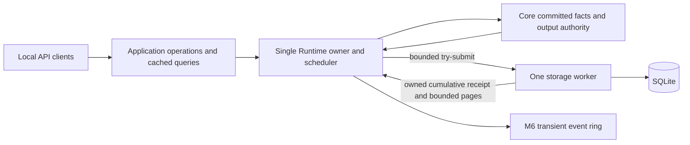

# Milestone 7: Runtime-owned Recorder and SQLite

Status: **DESIGN COMPLETE; ASTRA_HIGH -> SOL_HIGH requested. Await the manual
model switch before implementation.**

This document is the M7 implementation and tests-first acceptance contract. It
does not claim that recording is implemented. M8 configuration/COM, GUI,
persistent Lua, historical v1 import and automatic experiment recovery are outside
this phase. The product contract is [release plan sections 6–16](RELEASE_PLAN_M7_TO_V0_1.md).

## 1. Baseline and decisions

The inspected baseline is `edb436a` on `main`. The initial working tree was clean;
`ai/project_snapshot.txt` was absent. On 2026-09-15 Astra ran the required
`git status`, `git log --oneline -20`, `cargo test --workspace` and
`cargo clippy --workspace --all-targets -- -D warnings`: all checks passed.
`cargo test --workspace -- --list` listed 189 named tests. The workspace run
includes the actual Babashka A/B acceptance. The accepted M6 report remains the
source for its earlier debug/release and measured process evidence; this design
phase did not rerun the release profile or claim hardware acceptance.

Preserve [M6](MILESTONE_6_DESIGN.md), its [report](MILESTONE_6_REPORT.md), M4
Warming/private finite renewal and M5 generation/freshness/isolation contracts.
The required architecture and migration documents were read before design.
Their historical milestone labels and superseded Lua recommendations do not
override the current release plan.

Decisions fixed for Sol:

- Runtime owns recording lifecycle and policy. One additional storage worker owns
  one SQLite connection, writes, and bounded historical reads. No new crate,
  ORM, async runtime, GUI dependency or storage dependency in `lab-core`.
- Domain facts are captured at their actual commit/evidence boundaries. The M6
  event ring and JSON projection are independent consumers, never storage input.
- At most one run and one recording interval are active. M7 creates one interval
  per run; a boot can contain many successive runs. No automatic resume.
- Ingress, transaction batches, receipts, provenance, diagnostics, historical
  jobs/results and shutdown all have count, byte and/or lifecycle bounds below.
- SQLite uses WAL/FULL. Enqueue, domain completion, SQL commit, receipt delivery
  and physical evidence are different facts.
- BestEffort failure latches visible recording failure. Required failure closes
  the control gate, revokes, faults and drives Rust safe work without disk waits.
- M7 history is **bounded paged raw observations**. No server downsampling is
  advertised. This is the raw-paging option expressly allowed by the release plan.

### 1.1 Read-only donor findings

Inspected donor commit: `50d3d1e3de84c650e1aa0ffbf1625044f794d315` in
`D:\rust\com_port_reader`. No donor files were modified or tests executed.

| Actual donor source / behavior | M7 treatment |
| --- | --- |
| `src/process_recorder.rs`: `ProcessRecord`, action completion before sink publication | Adapt action/effect separation and test intent; use target identities and evidence |
| `AsyncProcessRecordSink::spawn`, `run_process_recorder` | Preserve one writer; replace unbounded channel, blocking finish/join and continue-control-on-any-failure policy |
| `writer_failure_remains_visible_after_logging_and_does_not_block_completion` | Adapt in D5/D8; persistence failure cannot rewrite a completed domain action |
| `bounded_observer_reports_loss_without_blocking_action_completion` | Adapt consumer independence; observer loss differs from durable loss |
| `explicit_finish_drains_records_and_reports_finalization_failure` | Adapt in D11/D12 with finite begin/poll shutdown |
| `src/process_recorder/sqlite.rs`: measurement transaction, WAL/NORMAL, session finalization, schema test | Adapt batching and reopen checks; select FULL, separate boot/run/interval, version schema, keep quality/provenance |
| `ProcessControlOutput::actual_output: Option<f64>` | Replace with separate typed evidence records, never infer a physical effect |

### 1.2 Source inspection determines necessary Core seams

`HostCore::service` and `command_with_cause` currently observe the M6 projection
after domain units. `EventLog::observe` can collapse intermediate transitions.
`Runtime::deliver_simulated` proposes, begins dispatch and completes readback in
one call. `handle_transport_event` separately handles uncertain/terminal/recovery
facts; `SignalBuffer::invalidate` can replace a same-time Good tail. Polling only
latest snapshots would therefore lose required evidence and observations.

The minimal M7 Core additions are an OS-free, bounded fact outbox; immutable
fact/provenance accessors; and a storage-independent required-recording gate with
a monotonic deadline and a scoped fault command. These are domain observation
and safety semantics, not SQLite or persistence implementation in Core.
`OutputCommand::Trip` and existing safe recovery remain the authority path.
The current private `fail_controller` and Warming handling must be reused or
extended so Required failure also fails a Warming controller with no lease.

## 2. Ownership, execution and module boundary



Suggested modules in the existing host crate:

- `recorder/mod.rs`: language-neutral record values, IDs, bounded validated
  options, policy/status and lifecycle coordinator;
- `recorder/port.rs`: bounded owned messages, accounting, receipts and worker
  begin/poll/close; a small replaceable sink seam for fault-injection tests;
- `recorder/sqlite.rs`: schema, prepared statements, transactions and recovery;
- `recorder/history.rs`: typed request/page/cursor validation and SQL selection.

Core may add `facts.rs` and a small recording-prerequisite type. Keep facts as
plain typed data with English documentation, no serde/SQL/path/thread/clock APIs.
Do not add traits per record type or a general event bus. SQLite and wire DTOs
map explicitly to these values; neither becomes the authoritative model.

The owner never opens a database, hashes a file, encodes JSON, waits on a worker,
logs to a console in a service unit, or holds a lock used during SQLite work.
The worker may block on disk in its own thread. It cannot borrow Runtime,
OutputAuthority or an executor. A returned history row never becomes a current
sample, lease, controller input or transport completion.

Use bounded std channels and prevalidated owned values. Any shared status cell
uses a nonblocking owner read (`try_lock`, or fixed atomics); a worker must not
hold its status lock across I/O. Owner failure to read a receipt never extends
the health deadline. Do not busy-spin waiting for a slot or a status lock.

One worker also serves short historical reads. This avoids a second connection,
reader lifetime pinning and a separate worker pool at this scale. Before each
history job it commits an available writer batch and services lifecycle work;
after at most one history page it returns to writer work. A page has a strict
row/byte/SQLite-work budget. If I/O stalls, the owner remains independent and
Required control reaches its deadline. No thread per query or connection.

## 3. Identity and recording lifecycle

### 3.1 Identities and time domains

| Identity | Meaning and scope |
| --- | --- |
| `database_id` | Random 128-bit ID created with the schema; retained on reopen |
| `boot_id` | Reuse the M6 OS-entropy process ID; new for every process startup |
| `run_id` | `(boot_id, checked run counter)`; logical experiment history grouping |
| `interval_id` | `(boot_id, checked interval counter)`; exact admitted recording coverage within a run |
| `activation_id` | `(boot_id, checked activation counter)`; an immutable actually committed composition/configuration snapshot |
| `record_seq` | Checked u64 order of recording facts within a boot, independent of M6 event sequence |
| `fact_seq` | Checked Core publication order, independent of wall time and sample timestamp |
| `object_key` | Boot + typed domain ID; signal includes instrument and parameter ID |
| `logical_key` | Trusted profile name/key for cross-boot discovery; no claim that equal names prove physical identity |

Generation, configuration revision and identity are distinct fields. Native
objects with no replacement capability have explicit generation 1, scoped by
boot. Managed generation/state revision and M3 binding generation/mapping revision
come from the actual committed object. Do not invent a revision on each query.

All monotonic values are elapsed nanoseconds from the existing M6 `SystemClock`
origin. Record `observed_at = Sample::freshness_at`,
`published_at = Sample::at`, and owner `captured_at` separately. Record ordering
is `record_seq`; equal times are permitted, and a Good/failure pair must survive.
Measurement time-range queries use `published_at`, with `record_seq` as tie-break.
This choice preserves arrival order for delayed managed observations; clients
also receive `observed_at` for inspection. No wall-time ordering or cursors.

At boot capture a bracketed pair: monotonic `m_before`, `SystemTime` UTC `w`,
monotonic `m_after`. Store the pair and uncertainty span. For a fact at monotonic
`m`, store `wall_estimate = w + (m - m_after)` and `wall_basis=boot_anchor`.
This is a mapped display estimate, not a device clock or repeated observation of
UTC. Read an actual UTC/monotonic anchor once per second off the control decision
path, and at interval start/end; store it as `clock_anchor`. A changed wall clock
never rebases monotonic history, deadlines or the initial mapping. Thus actual
wall start/end may jump or reverse while elapsed duration remains valid.

Use signed integer UTC microseconds since Unix epoch, supporting pre-epoch values;
reject arithmetic overflow as metadata failure, never feed it into control time.
An unavailable later wall read is a nullable actual anchor with explicit reason;
the valid boot mapping remains usable. No chrono dependency is needed for storage.

### 3.2 M7 lifecycle and usable entry points

The finite default demo and existing `--serve --profile virtual-demo --port ...`
remain valid without recording. Add trusted host options
`--record-db <local-path> --record-policy required|best-effort` to serve mode.
Supplying a database defaults to Required if policy is omitted. A policy without
a database is invalid. Options are immutable for the boot. Clients cannot supply
paths, change policy, disable the Required prerequisite or install definitions.
This is fixed-profile composition, not a TOML/reload design.

Startup validates bounds and provenance and opens the worker before readiness.
The worker must acquire the database, verify/create its schema, recover old
unfinished entries, and commit the boot/provenance metadata within a 2-second
startup deadline. Failure unwinds startup without arming. Failure to open even a
BestEffort database is a startup error: successful startup must not hide invalid
explicit deployment options. Safety establishment/cleanup still takes priority.

Owner states: `Disabled`, `Opening`, `Idle`, `Starting`, `Recording`, `Stopping`,
`Failed`, `Closing`, `Closed`. Status carries policy, IDs, first error, coverage,
queue usage, last confirmed commit, lag and terminal flush result. `Failed` is
latched for the boot; M7 has no automatic/live writer replacement. Process
restart may reopen the database, but does not resume the run or clear physical
faults by replay. Ordinary successful stop returns to Idle and permits a new run.

`recording_start {label}` creates a new run and interval, captures the **current**
committed configuration and boundary snapshot, and requests an immediate commit.
It completes only after the start barrier is durably acknowledged. While Starting,
new observations after the boundary are admitted behind that barrier with the new
IDs; they are not backdated. Already-running BestEffort control need not stop.
Required control remains inhibited until the start acknowledgement. A start
failure leaves explicit failed/interrupted metadata where writable, no successful
start result and no Required gate. Neither starting nor reopening starts a PID.

`recording_stop {run_id}` validates the exact current run and seals its interval
after the last admitted fact. With Required policy it rejects while any tracked
controller is Warming/Running, or any tracked output has a lease, pending ordinary
work, unresolved in-flight work, or lacks required safe evidence. The caller first
uses normal pause/safe operations. There is no implicit policy downgrade or rearm.
BestEffort stop can close coverage while virtual control continues under its
preselected policy. Stop completes after its terminal seal commits. New starts
are rejected while a start/stop is pending; retries follow M6 deduplication.

M7 deliberately has one interval per run. Keep separate IDs/rows because run
meaning and exact recording coverage differ; additional intervals, overlapping
runs and cross-boot continuation are unsupported, not silently approximated.
Outside an interval, only boot/storage lifecycle metadata is written. Normal
experiment activity is explicitly unrecorded. A new interval begins with a
boundary snapshot of current configuration, latest samples and pending operations;
these are `boundary_snapshot` facts, not newly observed measurements/actions.

## 4. Language-neutral records and provenance

### 4.1 Envelope and vocabulary

Every admitted record has schema kind/version, boot/run/interval/activation IDs
(run/interval may be absent for boot lifecycle), `record_seq`, source fact ID if
applicable, monotonic occurrence/publication/capture times, mapped wall time,
trusted origin, typed target and optional causal operation/output-attempt IDs.
Origin is assigned by Runtime (`native`, `managed_component`, `local_client`,
`host_lifecycle`); annotation content cannot overwrite it.

| Record family | Required typed content |
| --- | --- |
| Boot / run / interval | Start, boundary, stop intent, terminal seal, policy, counters, coverage, actual clock anchors and reasons |
| Configuration activation | Immutable profile/composition, build identity, object definitions, safety bindings, scripts and content identities |
| Measurement | Signal, exact typed value or unavailable reason, unit identity, observed/published times, generation, applicable revisions and lineage |
| Controller | Lifecycle before/after and cause; PID configuration revision/full config; successful native update diagnostics and consumed input/reference identities |
| Reference | Configuration before/after revision and values; actual evaluation time/value, unit and independent progress |
| Output | Requested, authorized/rejected/superseded, send_started, acknowledged, readback, failed, ambiguous, revoke, safe_requested and safe_evidence as separate kinds |
| Operation | Accepted normalized command, completed/failed with typed outcome, unresolved/outcome_unknown observation where meaningful |
| Managed component | Committed load/generation/config/source identity, accepted publication/state revision, failure; rejected candidate separate from committed configuration |
| Runtime log | Severity, stable subsystem/code, target/cause, bounded message and bounded structured fields |
| External annotation | Validated name/data, server origin and actor scope; optional informational script identity, never trusted evidence |
| Recorder gap / failure | First missing fact/sequence when known, coverage boundary, reason, known counts and explicit unknown tail |
| Shutdown | Frozen per-output evidence, producer/lease state, worker cleanup status, loss/flush barrier and seal |

Do not serialize Rust `Debug`, opaque executable permits or raw transport handles.
Store actuator values with units. Value kinds are float, signed integer, boolean,
text and enum; preserve type without integer-to-float conversion. Good requires
a value and no failure; Unavailable requires a reason and no value. Failure is
not zero, the previous Good value, or a sample with refreshed observation time.
M7 does not add fictional quality variants. Historical staleness is evaluated
against the recorded observation time by a consumer, not written over raw quality.

Measurements contain source generation, configuration revision(s), managed state
revision when applicable and input lineage. Native/managed revision 1 is explicit
where immutable. Resource binding generation and mapping revision are separate
when present. A derived sample preserves captured upstream identity/time, never
looks up today's generation after asynchronous completion. Extend immutable Core
publication metadata where current Sample alone lacks that information.

Controller updates retain the existing PID/EMA diagnostics, reference revision
and value, requested output and causal output attempt. These are diagnostics,
not additional physical measurements. Reference evaluations likewise retain
independent time semantics. No new generic signal graph is required.

### 4.2 Capture must not lose intermediate facts

Add a bounded Core outbox enabled by trusted composition. Emit plain facts at
successful publication/configuration/lifecycle commits, output admission, actual
send evidence, validated ACK/readback and uncertainty/recovery boundaries. Emit
facts even when the enclosing command returns an error after a committed change.
Drain after **every** owner domain unit, including startup and shutdown units;
do not inspect only the latest sample at the end of a turn. Output actions inside
one tick get distinct ordered facts even at the same monotonic timestamp.

Allocate correlation before proposal admission: boot-scoped output attempt ID,
actuator, controller/update or external operation ID, authority instance/epoch,
proposal sequence, binding generation and transaction/dispatch ID when assigned.
Accessor-only diagnostic IDs must not enable clients to construct a valid permit.
Rejected pre-dispatch attempts still have an attempt identity; no invented
transaction identity. Superseded proposals have an explicit outcome.

The outbox has a sticky overflow indicator and first-lost fact identity, independent
of free slots. It never blocks or recursively logs its own failure. Under Required,
exhaustion closes the ordinary-control prerequisite immediately within Core;
safe work continues even if its audit facts cannot be retained. The owner then
applies the full fault scope before another ordinary unit. Under BestEffort,
recording fails visibly while the domain action's real result remains unchanged.
Draining is an explicit owner action, not a Query side effect. Disabled recording
must not accumulate an unused outbox.

M6 projection keeps its existing event sequence, snapshot barrier and eviction.
It may publish recording health/operation changes. Event-ring overflow has no
effect on storage completeness; storage failure does not erase client events.
No durable exact replay of M6 subscriptions or restoration of session dedup state.

### 4.3 Evidence semantics

| Fact | What it establishes |
| --- | --- |
| Requested | A producer proposed a target; no authorization or I/O claim |
| Authorized | Current Rust checks admitted that exact target; may later expire or be revoked |
| Send started | Trusted dispatch has actual send-start evidence; for M3 at least one byte was accepted by the adapter, for virtual output dispatch began; not proof of complete bytes or device effect |
| ACK | A correlated protocol acknowledgement validated by Rust, with observed time/source |
| Readback | A matching Rust-validated subsequent observation, with value, unit, time and verification basis |
| Failed before send | Definite rejection/cancellation before the send boundary; no bytes from this attempt |
| Failed after send / ambiguous | Error or unresolved effect after possible I/O; does not establish absence of physical effect |
| Safe evidence | Evidence for the specific safe attempt, current epoch/binding, after earlier in-flight ambiguity is settled, at the profile's required level |

Virtual dispatch is marked `simulated`. Physical M3 fake-adapter tests are marked
`test_transport`, never real hardware evidence. Existing Core
`ReadbackVerified` also populates its acknowledged snapshot: record the trusted
readback outcome without inventing an independently observed wire ACK. If an ACK
stage is derived from that outcome, its basis is explicitly `implied_by_readback`,
not `protocol_ack`. An actual ACK-only Metakon completion remains ACK-only.
Store the two evidence kinds distinctly and preserve their different sources.
Readback of a register is not measured heating power or physical effect.

Preserve the M3 distinction between a send attempt and send evidence:
`try_write -> Ok(0)` is not sent and must revalidate before retry. Capture a
positive-prefix send at `AuthorizationStep::Started`, without moving the final
authority check away from `AuthorizationStep::Validate`. A failure after entering
I/O with no positive-prefix evidence is not sufficient by itself to claim
`failed_before_send`; retain `send_evidence=unknown` unless the trusted adapter
contract establishes that no bytes were accepted. Persistence observes these
facts; it cannot strengthen the adapter's evidence.

An obsolete completion can be retained as `ignored_late_completion` with its
original correlation; it never updates current authority or a new attempt's
evidence. Ambiguity can be recorded first as unsettled and later as settled with
effect still unknown. Do not rewrite the earlier uncertainty away.

### 4.4 Configuration and script provenance

Build an immutable activation manifest from the **validated committed** profile:
runtime version/build identifier; native plant/filter/controller/Reference config;
timing and recording limits; instrument descriptors/definitions and instance
bindings; safe profiles; managed manifest, source bytes and initial configuration.
At start include current controller/Reference revisions, not their startup defaults.
Each subsequent committed configuration change records its full bounded new value
and revision before any dependent fact, and links it to the activation baseline.
Historical reconstruction is baseline plus ordered committed revision records.

Use SHA-256 of exact script/definition bytes and deterministic manifest encoding.
Encoding version 1: UTF-8 JSON with lexically ordered object keys, fixed typed
fields, canonical decimal strings for IDs/i64/u64, finite numbers and normalized
negative zero; preserve array order where semantic. Record the encoding version
and hash algorithm. Hash the actual loaded bytes before activation, never reread
a mutable pathname at recording time. For native fixed composition store the
bounded canonical manifest and its hash. Paths/labels are optional metadata only.

Managed sources are at most the existing 32 KiB each; provenance stores exact
source content plus hash. The total staged manifest/content set is at most 1 MiB
and 128 entries. Split large descriptor sets into bounded entries. Duplicated
content is referenced by hash; no unlimited in-memory version cache. Keep only
the active provenance set; old versions live in SQLite. Rejected candidates can
have a diagnostic hash/reason but never become the active revision.

Each stored entry and the manifest root fit the 64 KiB record bound; the root
references separately hashed entries rather than embedding the entire 1 MiB set
in one SQL value. The activation row references that root. Transfer ownership of
the frozen manifest to lifecycle work without cloning another unaccounted set;
perform canonical encoding/hash computation on the worker. Current scalar config
values are captured on the owner before transfer, so later retunes cannot change
the candidate's meaning while it is being persisted.

The minimal later seam accepts a validated immutable `activation manifest` and
committed content identity. `runtime.toml`, COM loading/reload and Lua workspace
are not implemented here. Record `not_present` for absent deployment/workspace
scripts, not fake hashes. An external annotation may include a caller-claimed
procedure hash; its trust is `caller_supplied`, separate from Runtime-loaded code.

## 5. Bounded ingress, batching and durable progress

### 5.1 Fixed M7 bounds

These are host defaults and hard production maxima for M7. Tests can inject
smaller valid limits to exercise boundaries. Enlarging them requires an explicit
boundedness review, not silent dynamic allocation.

| Structure / budget | Bound and overflow behavior |
| --- | --- |
| Core outbox per owner unit | 256 facts and 256 KiB accounted owned memory; overflow flag + failure policy; no eviction disguised as success |
| One ordinary host record | 64 KiB accounted including owned strings/arrays and conservative encoded size |
| Recorder ingress, including worker-held uncommitted records | 1,024 records and 4 MiB; try-admit complete group or fail; never block |
| One atomic capture group | 256 records / 512 KiB; an oversized unit fails recording; no partial admission |
| Transaction / worker pending batch | 256 records / 512 KiB, a subset of ingress credit; one transaction at a time |
| Startup/start provenance transaction | At most 128 provenance entries / 1 MiB plus bounded boundary snapshot up to 256 KiB; dedicated lifecycle transaction, at most one retained |
| Flush cadence | Commit at group/batch limit, lifecycle barrier, or 100 ms after the oldest uncommitted group; never reset age on arrivals |
| Durable health probe | One coalesced probe every 250 ms while Recording, including idle acquisition; it performs a real committed metadata update |
| Required unconfirmed-progress age | 2 seconds; immutable profile value for M7 virtual acceptance |
| Worker status / lifecycle control | One cumulative receipt cell and one shutdown/failure seal slot up to 16 KiB; separate from ingress |
| Owner pending-credit metadata | At most 1,024 entries, 64 KiB; sequences, charge and submission times only, no cloned payloads |
| Emergency diagnostics | 32 entries / 16 KiB, oldest-first eviction; first error + loss summary retained separately in at most 4 KiB |
| Annotation | Name 64 bytes; data at most 2 KiB including worst-case JSON escaping, depth 4, 64 total values/members; strings at most 512 bytes |
| Runtime log | Message 256 bytes, at most 16 scalar structured fields / 2 KiB total |
| Historical jobs/results | 8 total slots including running and completed, one per connection generation; request <= 1 KiB, result <= 8 KiB |
| Page limits | At most 128 complete rows and 8 KiB encoded page data; full NDJSON <= existing 16,384 bytes and existing depth/value limits |
| History execution | At most 129 rows visited for selection, 100,000 SQLite VM instructions and 50 ms cooperative execution budget per page |
| History residence | 2-second submission deadline, 5-second completed-page TTL; cursor TTL 30 seconds per admitted page chain |
| Shutdown flush | 2 seconds after the final safety/cleanup snapshot; no unbounded retries/join |

Count bounds include records currently inside encoding/SQL work. Byte charges
include capacities, nested values and headers, not `size_of` alone. Reserve
credit before cloning/encoding; encode off-owner with a capped buffer. Reject
an oversize annotation before operation acceptance; native oversize facts are a
recording failure, not a silent truncation. One whole history row must fit a
page under the validated source bounds; otherwise return a named size error.

Conservative maximum application-owned recording data is bounded by ingress
4 MiB + provenance/boundary 1.25 MiB + Core outbox 256 KiB + encoder scratch
512 KiB + fixed receipts/metadata/history/diagnostics (under 256 KiB), under
6.5 MiB excluding SQLite and allocator overhead. Sol must verify actual accounting
and document SQLite cache/statement settings separately; this is not a whole
process RSS promise. The M6/Lua caches retain their existing separate limits.

### 5.2 Admission, batching and receipts

The owner assigns record sequences to a capture group and either transfers the
whole group or retains none of its payload. An outbox drain/submit never waits
for disk. Only one bounded group is being assembled. Group boundaries preserve
causal ordering; a transaction does not split a group. The worker appends groups
until adding another would exceed count/bytes, then commits. It may hold at most
one next group, still charged to ingress, never a second hidden batch.

For a transaction: validate all records/foreign references; begin transaction;
insert facts and their typed projections; update durable checkpoint; commit;
only then publish the cumulative receipt. If validation or SQL fails, rollback
the whole transaction and publish failure. Do not retry an ambiguous commit as
though it were known absent. No per-row success receipts before commit.

Receipt fields include service generation, last confirmed commit number,
`persisted_through_seq`, probe's original owner submission time, counts/bytes
released, active lifecycle barrier completion and sticky error. The receipt is
cumulative, so coalescing cannot lose progress or free credit twice. The owner
releases credit only after validating the receipt against admitted work. A stale
generation, future sequence or regressing receipt cannot reopen the gate.

`persisted_through_seq` names the highest record committed by the worker, not the
last enqueued fact or a device event cursor. Coverage is a separate `complete`,
`gap`, or `unknown_tail` value. Following an explicit gap, a higher persisted
sequence proves the gap marker was stored, not that missing samples exist.
The checkpoint row and covered facts commit atomically. An ACK lost between
commit and receipt is conservative uncertainty in memory; reopen may discover
additional valid committed rows. Exactly-once physical effects are never claimed.

### 5.3 Failure and gap representation

On first ingress/outbox overflow, slow-progress deadline, worker exit, encode,
quota or SQL failure, latch Failed. Stop normal recording admission for that
interval; do not produce alternating silent holes or automatically recover it.
Retain first failure code/time, confirmed checkpoint, first missing sequence or
fact identity, last accepted sequence, and counters for subsequently suppressed
facts. The loss suffix is open until coverage ends. Counter exhaustion cannot
wrap; it becomes explicit unknown count and closes ordinary admission.

Failure detection fixes the interval coverage end; subsequent ordinary experiment
activity is outside that closed recording interval. The gap covers the missing
suffix up to this cutoff, not an invented promise to record continuing activity.
The failure seal closes the run as Failed when writable. A worker that remains
usable may serve history and bounded emergency/lifecycle seals afterward, but
does not resume ordinary recording. At shutdown a later boot seal can include
the retained safe outcome without changing the failed interval to Complete.

If the worker remains writable (e.g. ingress overflow), drain the accepted prefix
and write one reserved gap/failure seal with exact known rejected range/count and
the interval's unrecorded suffix. This terminal marker uses reserved capacity;
it must not depend on freeing an ordinary queue slot. If storage itself failed,
retain only bounded in-memory failure/safe evidence and expose it in status/events;
do not claim that the fault recorded itself. Reopen marks the old interval
interrupted with an unknown tail. A missing suffix after crash has unknown length,
never fabricated timestamps or a guessed zero-loss outcome.

Repeated errors update bounded counters, not recursive log messages. Protocol
rejection floods are counted and sampled at most once per second per fixed
category; accepted external annotations are ordinary bounded records. Actual
domain configuration/output transitions during a healthy interval are not sampled
according to GUI visibility, subscription filters or display frequency.

## 6. BestEffort and Required control policy

### 6.1 Scope and gate

For M7 one configured Recorder covers **all tracked actuating outputs and native
controllers in the fixed host profile**, maximum eight each, including trusted
manual/local authority if installed by a test profile. Shared-output dependencies
cannot be omitted. All observations, configuration, output/evidence and lifecycle
records in that active run are mandatory under Required. No per-signal opt-out,
overlapping run scope or client-selected controller list is offered.

Observation acquisition, independent Reference evaluation, API queries, transient
diagnostics, safe/recovery work and unrelated non-actuating managed computation
may continue after a recording fault. An ordinary recorder failure does not kill
the entire Runtime. M7 has no second independently controlled recording scope;
future scoping must preserve dependency closure rather than infer it from names.

| Policy / state | Ordinary control |
| --- | --- |
| Recording disabled in unchanged M6 virtual mode | Existing reviewed behavior |
| BestEffort selected before startup | May continue virtual/native control through Idle/Failed; status declares missing durable coverage |
| Required, Idle/Starting/Stopping/Failed | New Start/Resume/acquire and ordinary proposals/dispatch denied |
| Required, Recording with committed start and healthy progress | Ordinary work permitted through the existing authority checks |

The physical-control default remains Required. M7 exercises virtual outputs and
trusted M3 test transports only; it does not authorize a new physical deployment
or define a weaker physical BestEffort profile.

The Core gate is a plain value containing required/not-required, current run
generation, open/closed/failed state and `valid_until` in monotonic time. Only
trusted owner lifecycle updates it. Check it at Start/Resume, Warming activation,
native update/renewal and immediately before an ordinary virtual dispatch or M3
first possible byte. Safe dispatch is exempt from recording availability, while
all its existing authority/evidence checks still apply. No network DTO maps to
gate updates. Direct local Core calls in a Required-enabled Runtime use the
same checks as the host path.

After every unit, and before the next, the owner samples sticky failure/receipts.
It derives the health deadline from the **oldest unconfirmed group's original
submission time + 2 s**. When no data is outstanding, use the last committed
probe's original submission time + 2 s. Sending a new probe, a worker heartbeat,
queue dequeue, partial transaction or receiving an old delayed receipt does not
renew health. Check expiry at equality. Real disk probes continue during quiet
recording so an idle stalled writer cannot retain a healthy gate forever. The
committed start barrier supplies the initial probe time; its original submission
time, not receipt arrival time, initializes the deadline.

This is bounded asynchronous recording, not fsync-before-every-output. A physical
effect may precede its durable fact, and up to the unconfirmed-progress window
plus the already-running bounded unit/scheduler delay may remain unrecorded on
crash. Queue exhaustion or known failure can close the gate earlier. The profile
constant is a virtual M7 acceptance value, not a hardware risk certification.

### 6.2 Required failure ordering

1. Latch the recording cause and close the prerequisite before the next ordinary
   producer/dispatch unit. Core outbox overflow/expired gate closes it inside the
   current unit before any subsequent ordinary send opportunity.
2. Fail every affected Warming/Running controller; remove native production and
   private renewal eligibility. Warming must not later acquire on a fresh sample.
3. Trip each tracked output through Rust authority, revoke lease/epoch and fence
   queued ordinary work, including local/manual owners. Continue across targets
   even if one target returns an error; retain each outcome.
4. Run the existing safe/recovery service. An in-flight physical write may still
   affect hardware; preserve unresolved correlation, finish framing recovery and
   establish required safe evidence before reporting safe. A timeout is failure
   with unknown effect, not a fabricated safe result.
5. Retain Failed controller state and output fault latch after safe evidence.
   Keep observation/diagnostic/API service alive. Recovery of storage or arrival
   of a late receipt cannot acknowledge a fault, reset a controller or rearm.

The detection deadline is serviced before ordinary work even if network queues
are full and both Lua workers stall. A worker failure concurrent with an already
executing bounded domain call is observed at the next boundary; no instantaneous
cross-thread revocation or rollback of bytes is claimed. The dispatch deadline
check still applies at the actual supplied monotonic time.

In M7 a failed Recorder remains failed until process restart. The existing
trusted fault acknowledgement/reset semantics remain separate; the external M6
API does not gain a reset/rearm bypass. Explicit recording stop/start is not
recovery of a Failed recorder. BestEffort failure never falsifies operation
success or safety evidence, and is visible to already connected and reconnecting
clients via the normal bounded snapshot/status path.

## 7. SQLite adapter and durable schema

### 7.1 Dependency and connection policy

Select `rusqlite` with only `bundled`, `hooks` and `limits` features in the host.
It provides the needed synchronous connection/transaction API; bundled SQLite
avoids a separate Windows SQLite installation. Use existing serde_json for the
adapter encoding, existing getrandom for IDs, and a small host-side SHA-256
implementation dependency ([RustCrypto `sha2`](https://github.com/RustCrypto/hashes/tree/master/sha2)); no hand-written crypto. Sol pins
resolved versions in Cargo.lock and records features/SQLite version in the report.
No dependency changes are made during Astra design. The [rusqlite project](https://github.com/rusqlite/rusqlite)
documents the bundled/features choice; its [Connection API](https://docs.rs/rusqlite/latest/rusqlite/struct.Connection.html)
provides busy timeout, progress handler and limits. Exact current crate version
is an implementation resolution, not a domain contract.

Use a local filesystem database and one connection on the storage worker. Reject
UNC/network paths in this M7 composition. Set a 100 ms busy timeout and acquire
exclusive ownership before recovering active boot/run rows. Validate existing
application identity/schema before any persistent PRAGMA or schema change; an
unknown database must not even be converted to WAL. An optional preliminary
read-only validation must be repeated under the exclusive lock before mutation.
For a validated or empty database, set and verify WAL, synchronous FULL,
foreign_keys ON and locking_mode EXCLUSIVE. A
second host must fail opening and must never mark a live first host interrupted.
Keep the lock until connection close. Live inspection uses the Runtime history
operation; third-party SQLite tools can open after shutdown. This avoids stale
lockfile recovery and a second ownership protocol. SQLite documents retained
exclusive locks in [locking_mode](https://www.sqlite.org/pragma.html#pragma_locking_mode).

Set SQLite cache target 2 MiB, mmap_size 0, prepared-statement cache <=32,
SQL length <=64 KiB and value/row length <=128 KiB. Query SQL is a fixed allowlist;
no loadable extensions, ATTACH, client SQL, URI query parameters or arbitrary
filenames. Temporary query structures are unnecessary for indexed paging.

FULL commits are the selected durability acknowledgement under SQLite and
filesystem/device guarantees. Enqueued/uncommitted records remain vulnerable.
WAL/NORMAL is not selected and must not be described as a power-loss guarantee.
The [SQLite synchronous documentation](https://www.sqlite.org/pragma.html#pragma_synchronous)
defines the difference; neither mode proves physical experiment safety.

Checkpoint after at most 1,000 WAL pages, between transactions/pages on the same
worker. Explicitly observe checkpoint failures; keep a 16 MiB WAL threshold
checked before the next ordinary transaction. At the threshold, checkpoint
before further ordinary admission to SQLite, or fail recording. A single bounded
transaction may cross that threshold; report actual WAL bytes and never treat
`journal_size_limit` as a hard allocation cap. No reader cursor retains a live
transaction. Maintain a 1 GiB main-database quota for the M7 demo via a checked
page-count limit (existing larger files fail startup), with a 5% reserve: refuse
ordinary transactions at 95%, leaving space for a bounded failure seal where
possible. Disk full may prevent even that seal. Do not delete/rotate authoritative
history automatically. Disk accounting and checks occur only on the worker.

The WAL is persistent database state. Reopen with SQLite recovery; do not delete
sidecars or copy the main file alone during active recording. A committed WAL
transaction need not have been checkpointed to count as committed. These rules
follow [SQLite WAL documentation](https://www.sqlite.org/wal.html); backup/import
tooling and rotation are outside M7.

### 7.2 Schema version 1

Use an application-specific `application_id` and `PRAGMA user_version=1`, plus
`schema_version` metadata containing schema/record encoding versions, database
identity and creation time. Pick one documented fixed application_id literal in
the implementation. Create schema atomically only in an empty database. A nonempty
unknown/v1-donor database, missing tables, incompatible encoding or future schema
is rejected unchanged; do not "repair" it with CREATE IF NOT EXISTS. M7 supports
create/reopen version 1, not historical migration. A later migration requires an
explicit versioned transaction and tests before it can be advertised.

SQLite INTEGER is signed. Keep domain u64 IDs/sequences/monotonic nanoseconds as
fixed-width 8-byte big-endian BLOBs where ordering is required, and bind them
explicitly; never cast overflowing u64 to i64 or store identity in REAL. Human
wire encoding remains M6 canonical decimal strings. UTC microseconds and typed
integer sample values use checked i64 INTEGER. Content hashes are 32-byte BLOBs.
Float values use finite REAL. IDs include their boot scope in keys and joins.

The following table/column contract is mandatory; SQL spelling and indexes may
be factored into readable statements without changing its semantics:

| Table | Primary key and essential columns |
| --- | --- |
| `schema_version` | singleton; database_id, schema_version, record_encoding, created_wall_us |
| `runtime_boots` | boot_id; build/version, anchor pair, started_wall_us, ended_wall_us nullable, lifecycle/exit summary, recovered_by_boot nullable |
| `runs` | boot_id + run_no; label, policy, start/end times, initial_activation_id, state, coverage |
| `recording_intervals` | boot_id + interval_no; run FK, boundary/start/end record sequences/times, state, coverage, loss summary |
| `configurations` | boot_id + activation_no; manifest root hash/content reference, encoding, committed time, initial object revisions |
| `provenance_content` | SHA-256 + encoding/kind; exact bounded source/definition/manifest bytes |
| `object_snapshots` | activation FK + typed object ID; logical_key, label, generation, descriptor/unit identity, instance binding, definition/source/safety hashes |
| `records` | boot_id + record_seq; run/interval/activation FKs, kind/version, fact_seq nullable, monotonic times, wall estimate, typed origin/target/cause, bounded payload |
| `measurements` | FK to records; signal IDs, generation/revisions, observed_at, published_at, unit key, quality, failure, value_kind and mutually exclusive typed value columns, lineage |
| `operation_events` | FK to records; original request scope/seq, phase, normalized command or terminal result/error, outcome basis |
| `controller_events` | FK to records; controller ID, before/after state or config/update kind, config revision, input/reference/output correlations, bounded diagnostics |
| `reference_events` | FK to records; Reference ID, revision, evaluation/config kind, value/target/rate/unit and progress time |
| `output_events` | FK to records; attempt/dispatch/resource IDs, actuator, authority epoch, generation/revisions, stage, value/unit, evidence source/basis, failure/ambiguity/settled flag |
| `runtime_events` | FK to records; managed/log/annotation/clock/shutdown category, severity/code, structured bounded data |
| `gaps` | FK to records; interval, first/last missing where known, known count, unknown-tail flag, reason, last confirmed checkpoint |
| `durable_checkpoints` | boot_id; commit_no, persisted_through_seq, last probe submission time and coverage; updated with each fact transaction |

`records` is the canonical durable envelope; family tables are transactional
typed projections, not independently writable second histories. Use foreign keys,
unique keys and CHECKs for enum/type/quality consistency. Configuration revisions
are append-only records, not mutable object_snapshots. Immutable payloads and raw
measurements never change on history access. Lifecycle/checkpoint rows may update
only in the transaction containing the corresponding fact/seal. No database
trigger invents ACK, action completion or controller state.

Required history index:
`measurements(boot_id, run_no, instrument_id, parameter_id, published_at, record_seq)`.
Include run_no as a checked redundant FK projection if needed by that index.
Index run listing by boot/run identity and operation events by original request
identity + record_seq. History reads use keyset bounds, not OFFSET or full-table
COUNT. Tests inspect query plans for indexed selection on a sizeable fixture.

### 7.3 Transaction failure and reopen

Any insert/commit/checkpoint error becomes a typed stable error with bounded
context. No confirmed watermark advance for a failed or unacknowledged commit.
Rollback failure means connection state is uncertain: stop writing, retain
failure, close on the worker when possible. No blind retry or duplicate INSERT
OR IGNORE to hide mismatched content. A duplicate exact record is at most a
verified idempotent replay of a bounded internal transaction; M7 does not need
automatic replay and must reject a same-ID/different-payload collision.

On reopen after exclusive acquisition, SQLite performs normal WAL recovery.
Verify identity/version/schema and checkpoint/fact consistency using bounded
indexed queries. Do not scan the entire history on Runtime startup. A mismatch
or corruption is `storage_corrupt`, never truncation, destructive repair or an
empty replacement database. Comprehensive integrity checking can be an explicit
offline tool later; it is not hidden in a status query.

At most one unfinished prior boot/run/interval exists in a valid version-1
database (enforce/test this invariant); recover that entry in a transaction under
the new boot. Mark it `interrupted`, with last durable fact time and
`tail_unknown=true`. Recovery discovery time belongs to the new boot and is not
the old experiment's end/physical-effect time. An accepted operation lacking a
terminal row stays accepted with outcome unknown; do not mark it failed or replay
it. More than one inconsistent active entry fails validation rather than running
an unbounded recovery loop. Reopen can discover a commit whose receipt was lost;
report recovered durable data, not a retroactive successful network response.

New boot, run, activation and interval identities are always allocated. Old
history remains readable through explicit archive identity. M6 scopes/cursors
are still invalid after restart, and no lease, PID memory, safe evidence or
Reference progress is restored from SQLite.

## 8. Public operations and bounded historical reads

### 8.1 API additions

Use the existing local version-one framing, strict known fields, operation
deduplication and connection-generation fencing. Advertise additions in hello.
Only advertise usable capabilities for the selected host options.

| Surface | Request and result contract |
| --- | --- |
| `recording_status` Query | Empty args; owned committed owner status, limits, IDs, confirmed watermark, coverage, health/error and flush state; no disk I/O |
| `recording_start` Operation | `{label}` <=128 UTF-8 bytes; accepted then start-barrier completed/failed with new run/interval IDs |
| `recording_stop` Operation | `{run_id}`; exact-current-run check, accepted then durable stop result or honest failure |
| `experiment_annotate` Operation | `{name,data}`; requires active interval, admitted bounded record; completion means accepted into recording ingress, with record_seq and `durability:pending`, not already committed |
| `history_read` Operation | Validated archive query below; schedules disk work and returns page token on completion; does not mutate experiment state |
| `history_page` Query | `{page_token}`; reads retained immutable result only, no SQL or automatic refill |
| `history_release` Session action | `{page_token}`; releases just that result; stale token cannot release its replacement |

Calling history work an Operation makes I/O explicit and preserves the repository
rule `Query = committed snapshot`. It is logically read-only: no refresh,
controller action, SQLite mutation, recording event or physical read is caused
by historical selection. History operation lifecycle remains process-local M6
session metadata and is not recursively recorded in experiment history.

Regular mutation accepted/completed records are emitted at the real application
boundaries with original request identity. Domain terminal outcomes do not wait
for fsync; recording lifecycle operations explicitly do. A duplicate retained
request returns its existing outcome without another durable action record.
Unknown outcome queries do not append unlimited pseudo-actions. Record an
`outcome_unknown` fact only for a real loss/reconciliation transition with known
operation identity, not every polling request.

For an operation spanning interval boundaries, the new interval boundary captures
its accepted-but-pending state as a snapshot; a terminal record carries the
original identity and whether acceptance was outside recorded coverage. If stop
closes before completion, the seal lists up to the existing 64 pending operations
or their bounded coverage summary; it never predicts terminal outcomes. Pause
and shutdown still complete according to actual safe evidence, independent of
whether their recording succeeds.

Lifecycle results and cached page tokens obey M6 terminal retention. Repeating
an evicted operation does not resubmit SQL or mutations. An expired page can be
requested explicitly with a new history-read operation. Disconnect drops queued
unaccepted work, but accepted recording operations remain Runtime-owned.
History jobs use connection-generation tokens: abandoned result delivery frees
its slot, never writes to a replacement connection or grows a tombstone list.

### 8.2 History request, watermark and cursor

`history_read` accepts exactly one of two modes:

1. `runs`: `{mode:"runs", database_id, max_records, cursor}`; max_records 1..32,
   cursor null on the first request; return boot/run summaries with keyset cursor
   and fixed 8 KiB result limit. No full count or scan of every run. This allows
   old runs to be discovered after process restart without prior client state.
2. `measurements`: `{mode:"measurements", database_id, boot_id, run_id, signal,
   from_ns, to_ns, max_records, cursor}`; cursor null on the first request.
   One signal per request; time range is half-open
   `[from_ns,to_ns)` on published monotonic time of that boot; max_records 1..128.
   Reject reversed/empty ranges, unknown IDs, mismatched boot/run, numeric overflow,
   noncanonical strings, excess fields and future/forged cursor state.

The first measurement page captures a durable checkpoint `W` on the worker before
selecting. Every subsequent page fixes the same `W` and original filter. Only
rows with `record_seq <= W` are eligible. Each page is a short read transaction
on the sole connection; no SQL statement/snapshot remains open while a client
thinks. Append-only rows plus frozen W provide stable paging without pinning a WAL
reader. Run-list pages similarly freeze the boot/run upper key and return
explicitly time-of-page lifecycle summaries (not a frozen full status snapshot).

Before releasing the first page transaction, capture the last matching compound
key at W using the same index in descending order with LIMIT 1. Store it in the
cursor and bound every later selection by that upper key as well as W. Per-signal
publication time never regresses; new equal-time facts have larger sequences.
Thus newly appended data cannot make an end-of-history page scan an unbounded
post-W tail. Boundary snapshots are not measurement rows and cannot backfill
earlier measurement keys.

Cursor contents: version, database identity, serving boot, connection generation,
query identity, requested archive boot/run/signal/range, frozen W,
last and upper `(published_at, record_seq)`, expiry. Keep one current cursor per connection
in the existing bounded slot and compare supplied fields to its retained value;
no cryptographic bearer authority or unlimited cursor registry. Reconnect or
server restart invalidates it explicitly (`history_cursor_expired` or
`instance_changed`). The client restarts from an explicit last key/range and
deduplicates by immutable record identity; it must not silently continue a new
query under the old cursor. Archive boot mismatch is different from serving boot
mismatch: old archive data is allowed, old server session authority is not.

Select after the last compound key, ordered by `(published_at,record_seq)`, up to
max_records+1. Encode complete rows until count, byte or existing wire-value budget
would be exceeded. Cursor advances only to the **last returned** row; a lookahead
row is not consumed. A byte-limited page can have fewer than requested rows.
`next_cursor=null` means no further matching committed rows at W, not that a live
run ended. Return W, record identities, limits, coverage and has_more explicitly.
There is no silent truncation to the newest samples.

Coverage comes from interval boundaries/gap summary. A complete page across an
incomplete interval remains `gap`/`unknown_tail`; page completeness and experiment
completeness differ. Raw Unavailable rows remain present and must not be bridged
as Good values. Empty ranges return an empty page with coverage information.
Data after W is available only through an explicitly new query.

The worker enforces a progress callback at most every 1,000 VM instructions,
100,000 total instructions, 50 ms elapsed execution and request cancellation.
Budget expiry returns `history_budget_exceeded`, no partial success or advanced
cursor; retry explicitly with a smaller range/page. Indexed LIMIT selection is
required in addition to the callback. OS disk calls may exceed a cooperative
deadline; the owner times out the job at 2 seconds, fences late results and never
spawns replacements for a stuck worker. A query timeout alone does not invent a
recording fault if writer progress remains healthy; a blocked writer that misses
the Required health deadline does trigger the normal policy.

### 8.3 Paging and downsampling boundary

Hello advertises `history_raw_paged_v1`, not `history_envelope`. Any requested
downsampling mode is rejected as unsupported. A large range is traversed through
bounded raw pages; the caller owns an explicitly bounded cache. M7 does not
accumulate the pages server-side or promise a constant-size representation of an
arbitrarily long run. This satisfies the release plan's raw-paging alternative.
Future min/max envelopes must be a separate explicit mode with preserved raw
data/quality; no GUI rendering, plotting algorithm or presentation model is
designed in M7.

## 9. Shutdown, flush and honest outcomes

Extend the existing M6 begin/poll shutdown rather than adding a blocking Drop.
Safety gets its unchanged 2-second grace, worker cleanup its existing bounded
budget, then Recorder gets a separate 2-second flush grace. Recording-enabled
shutdown target is at most 4.5 seconds plus one bounded domain unit and OS
scheduling delay; unchanged recording-disabled M6 shutdown retains its bound.

1. Raise the stop barrier, reject new control/configuration/start-recording/history
   jobs and quiesce producers. Existing safe/recovery work remains admitted.
2. Revoke and drive all tracked outputs safe while transports and Runtime exist.
   Keep Recorder accepting the resulting bounded safe/lifecycle facts. Never
   delay safe action to make room in the recording queue or obtain a commit.
3. Resolve safe evidence or expire its grace honestly. Complete bounded managed
   cleanup observation. Freeze per-output state, leases, faults, correlations and
   unfinished worker counts. Recording cannot promote unknown safe to confirmed.
4. Drain the final Core facts. Close normal recording admission and publish a
   reserved seal request naming the final accepted barrier, coverage/loss summary
   and frozen safety/cleanup facts. The worker drains only work preceding it,
   commits the terminal interval/boot seal, publishes its receipt and closes the
   connection. Shutdown intent cannot be lost behind a full ingress queue.
5. Poll without blocking until seal receipt and worker-finished status, or flush
   grace expires. Join only an already-finished thread. Keep Runtime/safe service
   available until the safety phase is resolved. Close transports afterward;
   no later ordinary producer or stale completion can rearm.
6. Publish the final process-local shutdown result through the existing bounded
   terminal network window, then exit. Terminal network delivery is separate
   from domain safety, durable sealing and worker cleanup.

Result fields: per-output safe outcome, controller/lease barrier status,
unfinished Lua/storage workers, recorder status (`disabled`, `flushed`,
`failed`, `timed_out`), final accepted sequence, last confirmed persisted sequence,
coverage, terminal-seal committed boolean and exit success. Successful recording
flush requires the entire accepted prefix plus terminal seal, with no recording
loss/failure. A committed failure/gap seal is useful durable metadata but is not
`flushed_complete`. BestEffort failure is still reported and makes an attempted
recording-enabled shutdown incomplete/nonzero; it does not falsify safe output.

The durable seal stores observed safety/cleanup facts and its barrier, not a
self-referential claim that a future close/terminal network write succeeded.
Presence of the seal proves its transaction committed. Owner success additionally
requires its confirmed receipt and worker cleanup. A commit/receipt race or close
failure may leave a seal on disk despite an in-memory incomplete result; reopen
reports that distinction. Drop never synthesizes a successful seal.

If the worker is stuck in OS I/O, latch timeout, retain bounded diagnostics and
detach at most this one worker at final process shutdown. Do not wait/join forever,
kill a Rust thread, spawn replacements or allow another same-process writer on
that database. Request cancellation between SQL units; an already executing
commit can still finish after the deadline. Reopen may find that commit, so
`timed_out` means unconfirmed at the deadline, not proven absent. Physical safety
and flush success remain independent in every branch, including fatal owner error,
full queues, dead clients and both Lua workers stalled.

## 10. Tests-first acceptance contract: D1–D18

All rows are mandatory. Add failing behavior tests before production changes for
each slice. Record red failure and green evidence in `MILESTONE_7_REPORT.md`.
Descriptive function/file names are required; IDs label coverage, not execution
order. Existing test names stay unchanged. Smaller injected budgets are allowed
for pressure tests, but real SQLite/process acceptance also exercises defaults.

Test support: deterministic independent monotonic/wall clocks; barriers that
prove the writer actually reached blocked I/O/commit; bounded sink failure at
specific insert/commit/receipt/close stages; real temporary on-disk SQLite;
trusted M3 byte fixtures counting first-byte attempts; real process readiness
and kill/reopen harness. Never count a sleep, discarded error, mock whole Runtime
or skipped Babashka test as proof. Keep all waits and captured process output
bounded and release fixture barriers during cleanup.

| ID / suggested test file | Concrete stimulus and required oracle |
| --- | --- |
| **D1 — `recorder_sqlite.rs`** | Start a real file-backed interval; capture known native and managed observations across multiple batches, stop/close, reopen and read via the history service. Assert exact values/count/order/IDs, committed start/seal and checkpoint. Include a batch still pending before explicit stop and reopen from WAL with committed data. Neither enqueue nor in-memory sink data qualifies. |
| **D2 — `recorder_quality.rs`** | Good -> Unavailable(sensor/transport/component failure), including the Core same-publication-time invalidation case and delayed derived publication. After reopen assert both committed facts survive, null value/reason pairing, original observed time, no stale Good substitution or interpolated history. Cover all current Value variants, i64 extremes and finite-float validation. |
| **D3 — `recorder_provenance.rs`** | Record Celsius/percent and distinct stable IDs; commit controller/Reference revisions and managed generation/state revision changes through trusted existing operations. Deliver a late old-generation result. Assert each recorded measurement/config/output has the exact captured unit/generation/revision/binding provenance; late result cannot become a new-generation measurement. Native immutable generation 1 is explicit. |
| **D4 — `recorder_evidence.rs`** | Exercise one-call virtual propose/dispatch/readback, an actual M3 fake-transport ACK-only completion, rejected/superseded/expired-before-send proposals, partial-write uncertainty, recovery and safe attempts. Query SQLite rows and assert requested/authorized/send/ACK/readback/failed/ambiguous are distinct with original correlations. Virtual readback never becomes a wire ACK or physical heating proof. Revocation before first byte prevents ordinary bytes; a late ACK/readback cannot authorize or confirm a newer epoch's safe attempt. |
| **D5 — `recorder_operations.rs`** | Block writer after an accepted command but before its terminal record commits; execute a real retune/start/pause and disconnect its client. Domain outcome remains honest, recorded acceptance can precede terminal durability, duplicate request executes once. Kill after durable acceptance before terminal and reopen: outcome is unknown, never failed-by-assumption or replayed. Include pending operation at interval start/end, annotation receipt pending durability, rejected evidence-injection fields and no history-read audit recursion. |
| **D6 — `recorder_backpressure.rs`** | Confirm writer barrier; independently exhaust record count, byte credit, outbox, capture-group and provenance bounds, using many small and few maximum-size values. Assert peak counters including in-flight batch/scratch stay bounded, failed group admission is atomic, no blocking producer send, no recursive failure log. Ordinary queue saturation cannot hide the separate fault/seal signal; cumulative receipts release credit exactly once. |
| **D7 — `recorder_isolation.rs`** | Hold actual writer behind a confirmed barrier while a BestEffort native PID runs beyond three finite lease lifetimes; observe distinct inputs, trusted deliveries and finite renewal, M3 recovery and real socket queries before releasing the barrier. Repeat Required with fake clock past its deadline: safety progresses and trips while disk remains blocked. Also hold both real Lua slots to prove storage shares neither owner nor Lua execution capacity. |
| **D8 — `recorder_failure.rs`** | Under preselected BestEffort inject overflow, worker panic/exit, stalled-progress and disk/encode failure. Status and reconnect snapshot retain first failure, loss boundary, confirmed watermark and bounded diagnostic counters; virtual control/observations continue. If writer is writable, reopened DB contains accepted prefix plus gap seal. If unwritable, live status says failure was not persisted; no automatic recovery or policy switch. Event-ring overrun alone must not cause a recording gap. |
| **D9 — `recorder_required.rs`** | Required start is denied without a committed start barrier. Fail Recorder while Running and while Warming/no lease; all tracked control fails, leases/epochs revoke, queued ordinary bytes are fenced, trusted safe work runs before any later ordinary send. Include manual/local ownership, multiple outputs with one failed recovery, direct Core dispatch after deadline and stalled/old/future receipts. At exactly 2 s unconfirmed age trip; heartbeat/dequeue/quiet-loop probes do not extend it. Safe-confirmed outputs remain fault-latched; unavailable physical evidence stays unknown; independent observation/API survives. Stop while active is rejected; recovery/start/reconnect never auto-rearms. |
| **D10 — `recorder_transactions.rs`** | Real SQLite constraint/insert failure midway through a multi-family batch rolls back all its rows and checkpoint; prior committed prefix survives. Inject commit failure and commit-success/receipt-loss separately: owner never fabricates confirmation, reopen discovers only actual commits. Same-ID/different-payload collision fails, not ignored. Assert WAL/FULL/foreign keys and schema version; unknown/future/donor/corrupt DB rejected unchanged. Test database quota and checkpoint failure without deleting data. |
| **D11 — `recorder_shutdown.rs`** | Start Running with uncommitted records, request shutdown with no client and separately through API. Assert producer barrier -> revoke/safe evidence -> final facts -> commit seal -> worker close -> terminal result. Reopen and find the final measurements/evidence, run/interval end and boot seal. Repeat successive clean runs in one boot and repeated finish polling; no duplicate terminal records. Full ingress still admits shutdown intent and drains its accepted prefix. |
| **D12 — `recorder_shutdown.rs`** | Inject final insert/commit/close failure and an indefinitely blocked writer; cross flush deadline with deterministic clock and exercise real process exit watchdog. Result distinguishes safe success from failed/timed-out flush and unfinished worker, exits nonzero, never joins a running thread or claims all records durable. Combine with unconfirmed M3 safe recovery, fatal owner path and two stalled Lua slots. Reopen interrupted/unknown tail, and separately handle a late successful seal whose receipt missed deadline. |
| **D13 — `recorder_reopen.rs`** | Real process A records run A and is killed at barriers before commit and after commit-before-receipt; process B opens the same DB. Assert new boot/run/interval/activation identities, preserved committed prefix, old unfinished entries interrupted with unknown tail/time, old scope/event/history cursor rejected, no control replay/lease restored. A second concurrent host fails to open without modifying A's live rows; one closed boot can contain multiple distinct runs. |
| **D14 — `recorder_history.rs`** | Send overlarge/invalid range, IDs, limit, cursor, SQL/path/unsupported-envelope fields and malformed frames; reject before work. On a large indexed fixture, assert whole-row count/bytes/JSON-value/frame bounds, bounded selected rows/VM work/time and 8-slot limit including executing/retained results. Cached page/status queries perform zero SQL/domain work. Slow/nonreading peers, cancellation, expiry and stale connection generation cannot retain unlimited jobs or block safety/writer service. |
| **D15 — `recorder_history.rs`** | Page a known set with equal publication timestamps, delayed observations, byte-shortened pages, Unavailable rows and gap metadata; append rows between every page. At frozen W union of returned identities equals exactly the matching committed fixture with no duplicate/omission; append after W appears only in a new query. Cursor advances only through returned rows, not lookahead. Expiry/reconnect/archive mismatch explicit; no OFFSET shift or silent live substitution. Empty/end pages and run discovery after restart are covered. |
| **D16 — `recorder_provenance.rs`** | Load known script/definition bytes then change the source file before recording start; stored content/hash must describe loaded bytes, not new path contents. Retune PID/Reference before and during recording; replay baseline+revision facts yields the actual config at each measurement/output. Validate safety/build/definition/managed manifests, duplicate-content dedup and provenance limits. Rejected candidate never becomes active; caller script identity remains untrusted; no TOML/reload/Lua-workspace implementation. |
| **D17 — `recorder_time.rs`** | Run identical deterministic input/control scenarios with wall jumps forward/backward, pre-epoch UTC and failed later wall read. Compare PID/EMA state, Reference values, lease deadlines, send decisions and fact order exactly: they match the no-jump run. Persist actual anchor changes and stable boot-mapped estimates; observed/published/captured times remain distinct and monotonic domains never mix across boots. |
| **D18 — existing suites + M7 report** | All 189 baseline tests and new named D tests pass in debug/release; fmt/clippy/doc/diff checks pass, missing-docs stays active, Core remains std-only, finite demo works, real Babashka A/B and client task pass. Extend actual process acceptance to start recording, kill A, retain autonomous recorded control, reconnect B, pause/stop/shutdown, reopen/history inspect. Map every D ID to named tests/red-green evidence and record actual versions, limits and limitations. Stop for external review before M8. |

Additional acceptance detail is binding, not optional test padding:

- D4 must inspect facts captured within a single Core call; a test that supplies
  hand-made `requested/ACK/readback` rows to SQLite does not prove capture.
- D7 observes native progress while the writer is still blocked. D9 observes
  revocation and safe/recovery while it remains blocked, including first-byte
  counts. A passing eventual shutdown after releasing disk is insufficient.
- D10/D13 use real files/process recovery, not solely an in-memory DB. Process
  kill is not a power-cut or physical actuator certification.
- D14 bounds execution and retained memory as well as result count. D15 uses
  independent expected record identities, not the same SQL to derive its oracle.
- D18's recording-enabled A/B variant supplements the unchanged recording-disabled
  M6 test. Missing actual `bb` leaves this gate incomplete; normal Runtime startup
  still has no `bb.exe` dependency.

## 11. Sol implementation order and completion gate

1. After the manual ASTRA_HIGH -> SOL_HIGH switch, reread permanent coordination
   files, this design and accepted contracts; verify baseline. Add plain contract
   and fake-clock/fault-harness tests first, especially D2–D6 and D9.
2. Implement bounded fact capture/port/accounting and OS-free Required gate.
   Prove intermediate evidence and no safety wait before attaching SQLite.
3. Write real SQLite D1/D3/D10/D13/D16 red cases, then schema, batching, provenance,
   durable receipts, exclusive acquisition and reopen semantics.
4. Integrate Runtime lifecycle/producers and BestEffort/Required policies with
   D5–D9/D17. Exercise actual final dispatch, Warming and sticky failure scope.
5. Add history operations/cached queries and D14/D15, preserving wire limits,
   M6 deduplication and generation fencing.
6. Add D11/D12 shutdown/failure integration and D18 real recorded A/B process
   acceptance. Fix regressions within M7; no TOML, COM, GUI or Lua expansion.
7. Create `MILESTONE_7_REPORT.md` mapping D1–D18 to named tests, meaningful red/green
   evidence, resolved dependency versions, real process/reopen evidence, bounds,
   schema/durability behavior and limitations. Update user-facing recording/API
   docs and coordination to actual results. Do not claim future release features.

Required completion commands (Sol):

```powershell
cargo fmt --all -- --check
cargo test --workspace
cargo test --workspace --release
cargo clippy --workspace --all-targets -- -D warnings
cargo doc --workspace --no-deps
cargo run -p lab-runtime
bb --version
cargo test -p lab-runtime --test babashka_reconnect -- --nocapture
git diff --check
git status --short
```

Also execute `bb test-client` from `clients/babashka` and the recording-enabled
actual-process/reopen acceptance, naming exact commands in the report. Keep
logical documentation and implementation changes separate; do not commit without
user authorization. Preserve unrelated files and leave the donor read-only.

If implementation exposes a genuine contradiction in authority, recording-required
safety, immutable provenance, evidence, boundedness or shutdown, record the precise
issue only in `ai/HANDOFF.md`, set `STATUS: WAITING_FOR_REVIEW`, and stop. Routine
module/helper choices within this contract do not require a new architecture gate.

At successful M7 implementation completion set `STATUS: READY_FOR_EXTERNAL_REVIEW`
in `ai/HANDOFF.md` and STOP. M8 needs its own external approval and Astra design.

At this Astra checkpoint the design and acceptance contract are complete, with
no unresolved architectural contradiction. Request **ASTRA_HIGH -> SOL_HIGH**;
resume with M7 implementation only. Do not begin M8.
